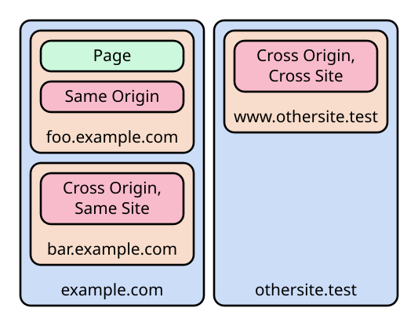

# CORS, CORP, COEP, COOP, and COnfusion

§In the beginning there was nothing. Then
[Sir Tim Berners-Lee](https://en.wikipedia.org/wiki/Tim_Berners-Lee) said: "Let
there be The World Wide Web". And Lo, there was The World Wide Web. And he saw
that it was **Good Enough**.§

In the early days of the web, there was nothing particularly sensitive or
dangerous available on it. No credit card numbers, no virtually signed
contracts, no secret documents. It was a place of experimentation, and the more
things could communicate with each other, the better.

That didn't last long, and the job of security has been playing catch-up ever
since. Rather than making large design changes to the fundamental protocols
(which would break existing sites), security patches have been added piecemeal;
fixing specific known vulnerabilities in a very conservative way. Web developers
continue to need to understand these security patches and their implications on
each new site. This article will focus on some security headers which have built
up over the years to facilitate safe Cross-Origin Resource Sharing (CORS).

If you don't care about the history or the whys, and just want to know which
combinations have what effects, skip to the
[summary of cross-origin headers](#appendix-summary-of-cross-origin-headers).

## Terminology

First some quick terminology which will be relevant in the following sections:

An **origin** is a full scheme, domain name, and port (the port may be
implicit), such as `https://foo.example.com:443`.

A **site** is a more relaxed version of this: it does not include subdomains or
the port, so for example `https://foo.example.com:1234` and
`https://bar.example.com:5678` are both on the same site
(`https://example.com`). Note that although the port can change, the scheme
cannot, so `http://example.com:80` and `https://example.com:443` are _not_ the
same site.

This article will use **page** to refer to a top-level document (typically a
HTML file, such as `https://example.com/index.html`) which may embed
**resource**s (such as images, scripts, videos, etc.) from its own origin or
other origins.


In this illustration, **site**s are shown in blue, **origin**s are shown in
orange, and **resource**s are shown in red. A request from foo.example.com to
bar.example.com is cross-origin but same-site. A request from foo.example.com to
www.othersite.text is cross-origin and cross-site.

## Showing resources from other origins

Many web pages embed resources (such as images, iframes, or even scripts) from
another origin. Sometimes this is for performance reasons (e.g. using a
third-party CDN to serve large images or fonts), sometimes for integration (e.g.
Facebook "like" buttons or badges on projects), but most often it is for
embedding adverts and trackers. All of these are known as "cross-origin"
resources.

Originally this was considered harmless and was allowed with wild abandon, until
an attack opportunity was noticed: if a malicious page loaded content from a
different origin which the current visitor was logged in to, then it could see
content from that origin which was only intended for the visitor. In this way,
cookie-based authentication, IP allowlists, and local network resources could be
breached just by visiting a malicious page.

For security, these cross-origin requests would need to be blocked. But blocking
all cross-origin requests would break a large number of sites (and worse: break
advertisements), so after some trial and error, the
[`Origin`](https://developer.mozilla.org/en-US/docs/Web/HTTP/Reference/Headers/Origin)
request header and [`Access-Control-Allow-*`][`Access-Control-Allow-Origin`]
response headers appeared[^timeline].

The idea was simple: servers can check the unspoofable `Origin` request
header[^spoof], and if they _intentionally want_ to share the requested resource
with that origin, they can include an `Access-Control-Allow-Origin` response
header to make that approval explicit. By doing so, the server takes
responsibility for making sure that either the requesting origin is trusted, or
that the content won't ever include anything sensitive (e.g. anything unique to
the user, or with restricted access). If the header isn't included in a response
(or doesn't list the origin which requested it), then the resource is blocked by
the browser.

So `Access-Control-Allow-Origin` allows explicit Cross-Origin Resource Sharing
(CORS): the provider of a resource can explicitly allow the resource to be used
in other origins. Everything else is blocked.

This solution was considered **Good Enough**.

## Showing resources from uncooperative origins

For perfectly benign reasons, plenty of pages still wanted to be able to show
content from other origins which did not add the `Access-Control-Allow-Origin`
header.

After some trial-and-error, the [`crossorigin`] attribute was introduced for
various HTML elements and the concept of a "CORS" vs. "non-CORS" request
appeared. The idea was simple: If a page wants a cross-origin resource, but the
resource does _not_ have the required ACAO header, then it can still be loaded
and displayed, but will be "tainted". The page will not be able to access any
information about it (such as response status, headers, or even pixel data of
images). Errors from tainted scripts cannot be captured by `error` listeners.
Tainted images and videos can still be copied to a canvas, but by doing so the
canvas also becomes tainted, meaning Javascript can no longer read pixel data
from it. In short: the resource can be _displayed to the user_, but cannot be
_accessed programmatically_.

Resources loaded with a `crossorigin` attribute are CORS, and continue to check
the `Access-Control-Allow-*` headers. Resources loaded without this attribute
are non-CORS, and load regardless of the `Access-Control-Allow-*` headers, but
are marked as tainted. For example:

- a third-party tracker would be loaded with `crossorigin="use-credentials"` so
  that the third party cookies are sent with the request, then the response
  would set `Access-Control-Allow-Origin` to allow the tracker data to be used
  on the page;
- an image from an up-to-date CDN would be loaded with `crossorigin="anonymous"`
  so that no user data is included in the request, and the response would set
  `Access-Control-Allow-Origin` to allow the image to be used;
- an image from a legacy CDN would be loaded without any `crossorigin`
  attribute, and the response does not need to set any header. The image can be
  displayed but not inspected via Javascript.

With non-CORS requests, most setups which had been broken by the previous fix
started working again, and now it didn't come at the cost of leaking data
everywhere.

This solution was considered **Good Enough**.

## A spectre appears

For a long time it was assumed that if there is no way to access a piece of
data, then that data is safe. But then along came "speculative execution
attacks" (aka [Spectre]). These exploit performance optimisations which are
built-in to the _CPU itself_.

Put simply: modern CPUs try to run faster by predicting what will happen next,
using any data available to them. If they get this prediction right, the data
and instructions that will be needed next are already loaded into cache and run
faster. If they get the prediction wrong, execution has to pause while the
correct data is loaded in. This means that correctly-predicted operations run
faster than incorrectly-predicted operations (sometimes by a large margin).
Because CPU manufacturers didn't think they needed to add security checks to the
data available for speculation, an attacker who is able to measure timings very
precisely can exploit it to infer the contents of memory which they should not
have access to.

This new attack method caused quite a stir. It couldn't be entirely fixed at the
CPU level for existing hardware, so operating systems had to step in and start
explicitly flushing speculation data from the CPU at sensitive moments. Roughly
speaking, the operating system allows process 1 to perform some work, then
flushes the data from the CPU, then allows process 2 to perform some work. This
isolates the data of process 1 from process 2, even with Spectre-style attacks.

With this fix, as long as sensitive data does not live in the same _process_ as
untrusted code, it can be considered safe[^rowhammer]. Browsers had already been
moving towards using separate processes for each origin for isolation and
performance reasons, so this model matched up nicely, but with one exception:
tainted cross-origin data.

To avoid attacks, any page containing tainted cross-origin data would need to
defend against Spectre in some other way. The obvious thing to do was look at
the other requirement for successful Spectre attacks: high resolution timings.

Some of the newer features of Javascript at the time were focused on high
performance, which made them ideal ways to measure very precise amounts of time.
One example is `SharedArrayBuffer`, which allows `WebWorker` threads to share
memory. An attacker can use one worker to do nothing except update a shared
memory value at high speed, and another worker to perform an operation which
will (thanks to speculative execution) run quickly if a piece of protected
memory has a particular value, and more slowly otherwise. The shared data
(acting as a very high-resolution clock) can be used to check whether it ran
fast or slow.

For security, this capability (as well as several other high-performance
features) would have to be blocked. The new APIs were removed.

This solution was considered **Good Enough**.

## Re-enabling high-performance features

Web developers still wanted to be able to use high-performance features, and
those who didn't even try to load cross-origin resources felt rather
hard-done-by with their removal.

After some trial-and-error, a new feature was added to bring them back. The idea
was simple: if a page wants high performance features, it has to _opt out_ of
being able to load external resources which don't set access headers. By opting
out of this feature, the page is considered
"[cross-origin isolated](https://developer.mozilla.org/en-US/docs/Web/API/Window/crossOriginIsolated)"
and can use the high performance APIs.

Three new headers were introduced:

- [`Cross-Origin-Opener-Policy`] (COOP);
- [`Cross-Origin-Embedder-Policy`] (COEP); and
- [`Cross-Origin-Resource-Policy`] (CORP).

By default (if the headers are not used), the assumption is that the legacy
ability to load cross-origin non-CORS resources without explicit headers should
work, and the fast APIs are blocked; no change from the previous setup.

But to be "cross-origin isolated" (and therefore have access to high-performance
features), both COOP and COEP must be set on the page:

- `Cross-Origin-Opener-Policy` must be `same-origin`. This header controls which
  origins are able to communicate with the page (e.g. if they open the page via
  `<a target="_blank" rel="opener">`). Setting it to `same-origin` blocks this
  communication, implicitly telling the browser to prefer keeping the page in a
  separate process which does not contain other origins.
- `Cross-Origin-Embedder-Policy` must be either `require-corp` (widely
  supported) or `credentialless` (not yet supported in Safari). Setting this
  header opts the page in to more stringent security requirements, controlling
  which resources the page is allowed to load via non-CORS requests:
  - If it is set to `require-corp`, non-CORS requests will only be allowed if
    the response includes an explicit `Cross-Origin-Resource-Policy` (i.e. it
    changes the default from `cross-origin` to `same-origin`).
  - If it is set to `credentialless`, the rules are relaxed a bit: resources
    without a `Cross-Origin-Resource-Policy` can be loaded, but now all non-CORS
    requests will be made without any credentials (such as cookies) included.

`Cross-Origin-Resource-Policy` and `Access-Control-Allow-Origin` are similar,
but apply to different types of request. CORS requests (which specify a
`crossorigin` attribute) continue to use ACAO, and do not check CORP. Non-CORS
requests (without a `crossorigin` attribute) continue to ignore ACAO, and now
check CORP.

If CORP is set to `cross-origin`, it means the resource is considered
non-sensitive: any page can load it via a non-CORS request _and_ have dangerous
JS features enabled. If it is set to `same-site` or `same-origin`, the resource
will be considered sensitive and cannot be loaded using non-CORS requests on any
page which does not meet the criteria (even if the page has not itself set a
COEP header).

With these headers set up, we get strong guarantees about whether our data is
allowed to share a process with third party origins, meaning (as long as it's
been set up securely): pages can once again use high-performance APIs, _without_
being able to use them to access sensitive data from other origins.

This solution is considered **Good Enough**.

## Appendix: Summary of Cross-Origin headers

Suppose we have a page at `https://example.com` attempting to load a resource
from `https://resources.test`. There are a variety of ways this could be set up,
which will control whether the resource loads at all, whether it is tainted, and
whether the request includes the user's credentials:

### With `crossorigin` (CORS)

When a resource is loaded using a `crossorigin` attribute, it does not matter
whether the page has a COEP header, nor whether the resource has a CORP header;
the behaviour depends only on the resource's `Access-Control-Allow-*` headers:

| Resource headers    | `crossorigin="use-credentials"` | `crossorigin="anonymous"`  |
| ------------------- | ------------------------------- | -------------------------- |
| _not set_ (legacy)  | :blocked:                       | :blocked:                  |
| {ACAO-*}            | :blocked:                       | :allowed:, no cookies sent |
| {ACAO-*;ACAC-true}  | :blocked:                       | :allowed:, no cookies sent |
| {ACAO-me}           | :blocked:                       | :allowed:, no cookies sent |
| {ACAO-me;ACAC-true} | :allowed:                       | :allowed:, no cookies sent |
| {ACAO-other}        | :blocked:                       | :blocked:                  |

Note that due to an
[unresolved bug in Firefox](https://bugzilla.mozilla.org/show_bug.cgi?id=1751105),
you may see more permissive behaviour than this when testing with two
`localhost` servers on different ports. For accurate results when testing in
Firefox, use different domains (e.g. `localhost` and `127.0.0.1`). Chrome and
Safari do not have this issue.

### Without `crossorigin` (non-CORS)

Without a `crossorigin` attribute, `Access-Control-Allow-*` headers are ignored;
the behaviour depends only on the value of the COEP header on the page and CORP
header on the resource:

| Resource headers    | COEP = `unsafe-none` (default) | COEP = `require-corp` | COEP = `credentialless`    |
| ------------------- | ------------------------------ | --------------------- | -------------------------- |
| _not set_ (legacy)  | :tainted:                      | :blocked:             | :tainted:, no cookies sent |
| {CORP-same-origin}  | :blocked:                      | :blocked:             | :blocked:                  |
| {CORP-same-site}    | :blocked:                      | :blocked:             | :blocked:                  |
| {CORP-cross-origin} | :tainted:                      | :tainted:             | :tainted:, no cookies sent |

High-performance APIs can only be enabled by setting both of these headers on
the page:

```http
Cross-Origin-Opener-Policy: same-origin
Cross-Origin-Embedder-Policy: require-corp
```

````md block-macro:{ACAO-*}
```http
Access-Control-Allow-Origin: *
```
````

````md block-macro:{ACAO-*;ACAC-true}
```http
Access-Control-Allow-Origin: *
Access-Control-Allow-Credentials: true
```
````

````md block-macro:{ACAO-me}
```http
Access-Control-Allow-Origin: https://example.com
```
````

````md block-macro:{ACAO-me;ACAC-true}
```http
Access-Control-Allow-Origin: https://example.com
Access-Control-Allow-Credentials: true
```
````

````md block-macro:{ACAO-other}
```http
Access-Control-Allow-Origin: https://other.test
```
````

````md block-macro:{CORP-same-origin}
```http
Cross-Origin-Resource-Policy: same-origin
```
````

````md block-macro:{CORP-same-site}
```http
Cross-Origin-Resource-Policy: same-site
```
````

````md block-macro:{CORP-cross-origin}
```http
Cross-Origin-Resource-Policy: cross-origin
```
````

```md inline-macro::allowed:
✅️ allowed
```

```md inline-macro::tainted:
⚠️ allowed, tainted
```

```md inline-macro::blocked:
❌️ blocked
```

## Further reading

MDN has a variety of guides and references on this subject:

- [Guide to CORS](https://developer.mozilla.org/en-US/docs/Web/HTTP/Guides/CORS)
- [Use cross-origin images in a canvas](https://developer.mozilla.org/en-US/docs/Web/HTML/How_to/CORS_enabled_image)
- [Preflight request](https://developer.mozilla.org/en-US/docs/Glossary/Preflight_request)
- [`Access-Control-Allow-Origin` header][`Access-Control-Allow-Origin`]
- [`Cross-Origin-Embedder-Policy` header][`Cross-Origin-Embedder-Policy`]
- [`Cross-Origin-Opener-Policy` header][`Cross-Origin-Opener-Policy`]
- [`Cross-Origin-Resource-Policy` header][`Cross-Origin-Resource-Policy`]
- [`crossorigin` attribute][`crossorigin`]
- [`window.crossOriginIsolated`](https://developer.mozilla.org/en-US/docs/Web/API/Window/crossOriginIsolated)
- [`Request.mode`](https://developer.mozilla.org/en-US/docs/Web/API/Request/mode)

[^timeline]:
    For the purpose of clearly explaining the attacks and mitigations, the
    timeline of security fixes presented in this article is an approximation
    rather than 100% accurate.

[^spoof]:
    Of course the header is only unspoofable if the request was made via a
    browser (which is the only scenario we care about here); outside the
    browser, clients can set any headers they like (but presumably won't have
    access to a user's cookies or other secrets).

[^rowhammer]:
    Not _entirely_ safe, thanks to other attacks like
    "[Row hammer](https://en.wikipedia.org/wiki/Row_hammer)" which exploit
    hardware glitches to read protected memory, but those are at least _much_
    more difficult to perform reliably.

*[aka]: Also Known As

*[CDN]: Content Delivery Network

*[CORS]: Cross-Origin Resource Sharing

*[CORP]: Cross-Origin Resource Policy

*[COEP]: Cross-Origin Embedder Policy

*[COOP]: Cross-Origin Opener Policy

*[ACAO]: Access-Control-Allow-Origin

[`Access-Control-Allow-Origin`]:
  https://developer.mozilla.org/en-US/docs/Web/HTTP/Reference/Headers/Access-Control-Allow-Origin
[`Cross-Origin-Embedder-Policy`]:
  https://developer.mozilla.org/en-US/docs/Web/HTTP/Reference/Headers/Cross-Origin-Embedder-Policy
[`Cross-Origin-Opener-Policy`]:
  https://developer.mozilla.org/en-US/docs/Web/HTTP/Reference/Headers/Cross-Origin-Opener-Policy
[`Cross-Origin-Resource-Policy`]:
  https://developer.mozilla.org/en-US/docs/Web/HTTP/Reference/Headers/Cross-Origin-Resource-Policy
[`crossorigin`]:
  https://developer.mozilla.org/en-US/docs/Web/HTML/Reference/Attributes/crossorigin
[Spectre]: https://en.wikipedia.org/wiki/Spectre_(security_vulnerability)
