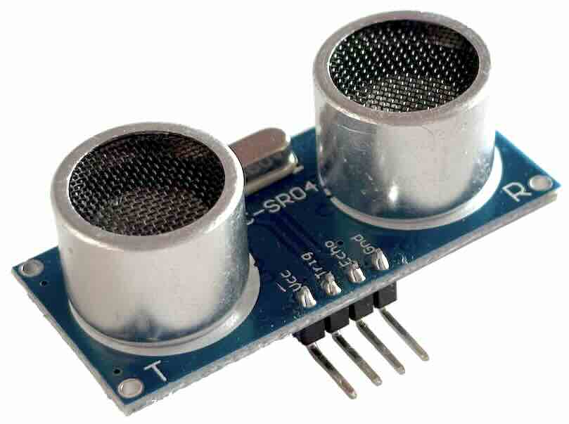
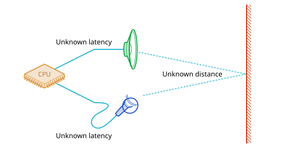

# Echolocation Part 1: The Mathematics

Echolocation (active SONAR) is the process of creating a sound then listening
for its echoes to determine the location of an object (such as how far away it
is, or a more complete position through triangulation).
[Several species of animal](https://en.wikipedia.org/wiki/Animal_echolocation)
(most notably bats and whales) use echolocation for navigation and hunting, and
can not only determine 3D locations of objects, but also classify the object
(getting information about its texture, density, and size).

Various types of specialist hardware also use echolocation; either for
navigation and mapping (such as ship SONAR), or for distancing (such as security
systems). However it is rarely used in general-purpose systems like laptops and
phones due to hardware-related uncertainties and a lack of practical
applications. In spite of this, it is still an interesting challenge to
implement echolocation for general-purpose hardware.

This article is the first in a 3-part series:

- Part 1 discusses the theory and mathematics of 1-dimensional echolocation
  (distancing);
- Part 2 (not yet posted) moves on to computing a (very) approximate 2D scene
  using multiple speakers and/or microphones;
- Part 3 (not yet posted) gives details of using the
  [Web Audio API](https://developer.mozilla.org/en-US/docs/Web/API/Web_Audio_API)
  to put theory into practice in a browser-based echolocation tool.

## Principle

At its most basic, echolocation consists of:

1. Make a sound;
2. Listen for the echo of the sound;
3. Use the measured time between (1) and (2) to estimate the distance of the
   object.

```json plot
{
  "title": "Basic principle of echolocation.",
  "type": "cartesian",
  "axes": [
    { "label": "time", "range": [0, 14] },
    {
      "range": [-6, 8],
      "line": false,
      "notches": false,
      "labels": [
        [
          0,
          {
            "label": [
              {
                "type": "image",
                "image": "./microphone.png",
                "margin": [0, -0.5, -2.8, 0],
                "height": 5
              }
            ]
          }
        ],
        [
          6,
          {
            "label": [
              {
                "type": "image",
                "image": "./speaker.png",
                "margin": [0, -0.5, 0, 0],
                "height": 5
              }
            ]
          }
        ]
      ]
    }
  ],
  "aspect": 2,
  "elements": [
    {
      "type": "equation",
      "equation": "y=6+pulse((x-1)/4)",
      "functions": {
        "pulse": { "parameters": ["t"], "equation": "sin(clamp(t,0,1)*20*pi)" }
      },
      "palette": 3,
      "description": "A sound sent from a speaker"
    },
    {
      "type": "equation",
      "equation": "y=pulse((x-2.5)/4)*0.8+pulse((x-9)/4)*0.5",
      "functions": {
        "pulse": { "parameters": ["t"], "equation": "sin(clamp(t,0,1)*20*pi)" }
      },
      "palette": 3,
      "description": "A sound and its echo received by a microphone"
    },
    {
      "type": "label",
      "text": "Sound out",
      "position": { "coord": [3, 7.2], "anchor": [0.5, 1] }
    },
    {
      "type": "label",
      "text": "Immediate feedback",
      "position": { "coord": [4.5, 1.2], "anchor": [0.5, 1] },
      "width": 5
    },
    {
      "type": "label",
      "text": "Echo",
      "position": { "coord": [11, 1.2], "anchor": [0.5, 1] }
    },
    {
      "type": "measurement",
      "text": "Measurable delay",
      "position": {
        "p1": [1, 5.5],
        "p2": [9, -0.5],
        "separation": 1,
        "direction": "x",
        "position": "below"
      }
    }
  ]
}
```

Since the sound has to travel out from speaker to object, then back to the
microphone, the distance can be calculated as approximately
$\frac{1}{2} \times \text{time taken} \times \text{speed of sound}$ (assuming
speaker and microphone are relatively close together).



The speed of sound in air can be approximated as 343m/s ±5%[^speed-of-sound], so
if our microphone picks up the sound 5ms after the speaker made it, the
soundwave must have travelled about 1.72 metres in total (round-trip), meaning
the object is 86cm away (±4cm)[^uncertainty].

This equation can also tell us how granular our answer will be: if we can
determine the time to within a millisecond, then we can calculate the distance
with ~17.2cm granularity (plus the overall 5% margin of error from variation in
the speed of sound). Most computers use an
[audio sample rate](<https://en.wikipedia.org/wiki/Sampling_(signal_processing)>)
of either 44.1kHz or 48kHz, so if we can get to-the-sample precision in our
timings (~0.02 milliseconds), we can expect a distance granularity of 3.9 or
3.4mm, plus the overall 5% margin of error[^subsample].

## Dedicated hardware

Hardware which performs this exact operation is readily available, such as the
[HC-SR04](https://thepihut.com/products/ultrasonic-distance-sensor-hcsr04), and
typically advertises accuracy of "up to 3mm" (theoretically requiring a sample
rate of at least 60kHz).

 An HC-SR04 Ultrasonic Distance Sensor. It has a
directional transmitter (speaker) on the left and a directional receiver
(microphone) on the right.

This specific example sends out a series of 8 very short 40kHz beeps (which
requires a digital sample rate of at least 80kHz due to
[folding](https://en.wikipedia.org/wiki/Nyquist_frequency)). The beeps are
inaudible to humans, since
[the human ear is unable to detect sounds above ~20kHz](https://en.wikipedia.org/wiki/Hearing_range),
but is audible to (for example) dogs, cats, and mice. It then listens for the
first echo which matches the same pattern of 8 pulses, and reports the time
elapsed.

## Can we do better?

Dedicated components have the advantage of directional speakers / microphones,
and very high sample rates, but they have minuscule processing power and only
report a _single_ reading: the time to first echo. Echoes contain much more
information: they can reflect back from different directions, and at each
boundary some of the soundwave's energy will continue into the object rather
than reflecting back. Objects will also absorb and reflect different frequencies
in different proportions due to
[resonance](https://en.wikipedia.org/wiki/Resonance). These behaviours mean we
should be able to see _multiple_ reflected echoes, and can say something about
each object's properties based on how strong the echo is at different
frequencies. [Doppler shift](https://en.wikipedia.org/wiki/Doppler_effect) means
we can even identify the relative speed of the detected objects.

## Signal

The first thing to notice is that if we wish to pick up more than one echo,
we'll need to use a more complicated signal than a fixed-tone beep. The sounds
are likely to be so close together that they overlap, which will be impossible
to distinguish if they are all the same frequency:

```json plot
{
  "title": "Spectrogram: simulation of a 10ms 40kHz tone being reflected off surfaces 40cm and 60cm away; can you spot where the echoes begin?",
  "type": "cartesian",
  "axes": [
    { "label": "time (ms)", "range": [0, 20], "grid": [10, 1] },
    { "label": "frequency (kHz)", "range": [0, 48], "grid": [10, 1] }
  ],
  "aspect": 2,
  "elements": [
    {
      "type": "map",
      "image": "./flat-sim.png",
      "description": "A single tone at 40kHz. It is almost impossible to see the echoes because they overlap the original signal.",
      "range": [
        [0, 20],
        [48, 0]
      ]
    }
  ]
}
```

$$
\begin{gathered}
\text{sample}(t) = \sin(2 \pi f t)
\\ \text{where} \quad
f = 40000
\end{gathered}
$$

Here it is useful to look to nature. Bats use a sound known as a "chirp". This
is a sound which starts at one frequency, then sweeps to another frequency over
time. As the echoes come back staggered over time, their frequency separation
makes them much easier to distinguish:

```json plot
{
  "title": "Spectrogram: simulation of a 10ms 40kHz–6kHz linear chirp being reflected off surfaces 40cm and 60cm away; the echoes are easily distinguished from the immediate feedback and each other.",
  "type": "cartesian",
  "axes": [
    { "label": "time (ms)", "range": [0, 20], "grid": [10, 1] },
    { "label": "frequency (kHz)", "range": [0, 48], "grid": [10, 1] }
  ],
  "aspect": 2,
  "elements": [
    {
      "type": "map",
      "image": "./linear-sim.png",
      "description": "A linear 40kHz–6kHz chirp. Both echoes are easy to see.",
      "range": [
        [0, 20],
        [48, 0]
      ]
    }
  ]
}
```

$$
\begin{gathered}
\text{sample}(t) = \sin\left(2 \pi \left(f_0 + \frac{f_1 - f_0}{2} \frac{t}{d}\right) t\right)
\\ \text{where} \quad
f_0 = 40000, \; f_1 = 6000, \; d=0.01
\end{gathered}
$$

Different species of bat have different sounds; the frequency range, duration,
and harmonics all vary. Some species even include a fixed tone in the middle of
their call (which they can use to detect relative velocity of the target object
via [Doppler shift](https://en.wikipedia.org/wiki/Doppler_effect)).
[Hunter Scott's The DSP Behind Bat Echolocation](https://www.hscott.net/the-dsp-behind-bat-echolocation/)
has spectrograms of a wide selection of real bat recordings, illustrating how
much variety there is.

Many bat species' calls contain a chirp which uses a hyperbolic curve in
frequency space, rather than being linear:

```json plot
{
  "title": "Spectrogram: simulation of a 10ms 40kHz–6kHz hyperbolic chirp being reflected off surfaces 40cm and 60cm away.",
  "type": "cartesian",
  "axes": [
    { "label": "time (ms)", "range": [0, 20], "grid": [10, 1] },
    { "label": "frequency (kHz)", "range": [0, 48], "grid": [10, 1] }
  ],
  "aspect": 2,
  "elements": [
    {
      "type": "map",
      "image": "./hyperbolic-sim.png",
      "description": "A hyperbolic 40kHz–6kHz chirp. It curves steeply from 40kHz to 20kHz or so, then is relatively flat. Both echoes are easy to see, especially at the higher frequencies where the gradient is steepest.",
      "range": [
        [0, 20],
        [48, 0]
      ]
    }
  ]
}
```

$$
\begin{gathered}
\text{sample}(t) = \sin\left(2 \pi f_0 \left(\frac{\log(c t + 1)}{c}\right)\right)
\\ \text{where} \quad
c = \frac{1}{d}\left(\frac{f_0}{f_1}-1\right), \;
f_0 = 40000, \; f_1 = 6000, \; d=0.01
\end{gathered}
$$

The advantage of such a curve is that it is not distorted by Doppler shifting,
which means the echo can be detected in the same way regardless of relative
velocities (very useful for a creature in flight).

It also has the nice property that higher frequencies account for proportionally
less of the signal. This means that if our signal is
[low-pass filtered](https://en.wikipedia.org/wiki/Low-pass_filter) at any point
(either intentionally by the speaker or microphone, or as the result of hardware
limitations), only a small part of it will be lost and we should still be able
to detect it reliably (though at a cost to the temporal accuracy).

We don't have to be constrained to nature, or even to lines:

```json plot
{
  "title": "Spectrogram: simulation of a 10ms sonified image (made using the Griffin-Lim algorithm) being reflected off surfaces 40cm and 60cm away. The source image was less creepy.",
  "type": "cartesian",
  "axes": [
    { "label": "time (ms)", "range": [0, 20], "grid": [10, 1] },
    { "label": "frequency (kHz)", "range": [0, 48], "grid": [10, 1] }
  ],
  "aspect": 2,
  "elements": [
    {
      "type": "map",
      "image": "./face-sim.png",
      "description": "A smiley face used as a signal. The echoes are easy to see, but it's not very practical.",
      "range": [
        [0, 20],
        [48, 0]
      ]
    }
  ]
}
```

So if we want to have some fun we could try locating things by bouncing smiley
faces off them.

For our purposes, the properties of the hyperbolic chirp make it a good choice
for getting started, even if we later revisit it to use something more
fine-tuned to the situation.

## Detection

Having an easily detected signal is all well and good, but how do we actually
detect it?

```json plot
{
  "title": "Signal components.",
  "type": "cartesian",
  "axes": [
    { "range": [0, 8], "line": false, "notches": false },
    {
      "range": [-1.5, 13.5],
      "line": false,
      "notches": false,
      "labels": [
        [12, { "label": "echo 1" }],
        [9, { "label": "+ echo 2" }],
        [6, { "label": "+ background noise" }],
        [3, { "label": "= mess" }],
        [-1, { "label": "desired output" }]
      ]
    }
  ],
  "aspect": 1.5,
  "elements": [
    {
      "type": "equation",
      "equation": "y=12+pulse((x-0.5)/4)",
      "functions": {
        "pulse": {
          "parameters": ["t"],
          "equation": "sin(a*ln(c*t+1)/c*pi)*smoothstep(0,0.05,t)*smoothstep(1,0.9,t)"
        }
      },
      "parameters": { "a": 20, "c": 1 },
      "palette": 3,
      "description": "first echo"
    },
    {
      "type": "equation",
      "equation": "y=9+pulse((x-2.3)/4)*0.6",
      "functions": {
        "pulse": {
          "parameters": ["t"],
          "equation": "sin(a*ln(c*t+1)/c*pi)*smoothstep(0,0.05,t)*smoothstep(1,0.9,t)"
        }
      },
      "parameters": { "a": 20, "c": 1 },
      "palette": 3,
      "description": "second echo"
    },
    {
      "type": "equation",
      "equation": "y=6+noise(x*20)*0.7",
      "palette": 3,
      "description": "background noise"
    },
    {
      "type": "equation",
      "equation": "y=3+pulse((x-0.5)/4)+pulse((x-2.3)/4)*0.6+noise(x*20)*0.7",
      "functions": {
        "pulse": {
          "parameters": ["t"],
          "equation": "sin(a*ln(c*t+1)/c*pi)*smoothstep(0,0.05,t)*smoothstep(1,0.9,t)"
        }
      },
      "parameters": { "a": 20, "c": 1 },
      "palette": 3,
      "description": "combination: a noisy mess"
    },
    {
      "type": "equation",
      "equation": "y=-1+pulse((x-0.5)/4)+pulse((x-2.3)/4)*0.6",
      "functions": {
        "pulse": {
          "parameters": ["t"],
          "equation": "exp(-t*t*10000)"
        }
      },
      "palette": 3,
      "description": "we want a clean peak for each echo"
    }
  ]
}
```

One approach would be to calculate a spectrogram from the microphone (like the
illustrations in the previous section) then use image analysis to locate the
shape of our signal. There are well known and efficient ways to find a known
shape in an image (e.g.
[Haar cascade classifiers](https://docs.opencv.org/3.4.20/db/d28/tutorial_cascade_classifier.html)),
and once we find it we can easily analyse the image to see which frequencies
have been absorbed (allowing us to do some rudamentary object classification).
We can also subtract each signal after we find it and search again to find the
next echo, even if they were overlapping. However, there is also a big
disadvantage to this approach: performing frequency analysis involves a
trade-off of frequency precision vs. time precision (due to the equivalent of
[Heisenberg's uncertainty principle](https://en.wikipedia.org/wiki/Uncertainty_principle))[^no-phase].
This significantly reduces our distance accuracy. Ideally, we would like to be
able to identify echoes with sample-level precision.

The solution to this problem is simple and elegant, but needs some introduction.

### Convolution

Suppose we wanted to go the other way: given a clean timeline showing the
instants and intensities of the echoes, as well as our signal, we want to
generate the audio which we would expect to hear. This process is called
"convolution", denoted $A * B$, where $A$ and $B$ are arrays of values.

To get a sense for the operation, a convolution can be implemented naïvely in
Python as:

```python
def convolve(A, B):
  result = [0 for i in range(len(A) + len(B) - 1)]
  for i in range(len(A))
    for j in range(len(B))
      result[i+j] += A[i] * B[j] # note: this * is regular multiplication!
  return result
```

If $A$ and $B$ have length $n$, this has a computational complexity of
$\text{𝒪}(n^2)$, which means it can slow down significantly as the length of the
inputs increases. It is much more computationally efficient to use the
mathematical identity:

$$
ℱ(A * B) \equiv ℱ(A) \otimes ℱ(B)
$$

Where $ℱ$ is the
[fourier transform](https://en.wikipedia.org/wiki/Fourier_transform) and
$\otimes$ denotes
[element-wise multiplication](<https://en.wikipedia.org/wiki/Hadamard_product_(matrices)>)[^log].
This identity lets us implement a convolution as:

```python
def convolve(A, B):
  fA = fft(A)
  fB = fft(B)
  for i in range(len(fA))
    fAB[i] = fA[i] * fB[i]
  return ifft(fAB)
```

Where `fft` is some implementation of the
"[Fast Fourier Transform](https://en.wikipedia.org/wiki/Fast_Fourier_transform)",
and `ifft` is the inverse; libraries with these functions exist for most
programming languages.

Our $A$ and $B$ inputs must now have the same size, and depending on the Fast
Fourier Transform implementation it may need to be a power-of-two, but there are
techniques to avoid these limitations (discussed in part 3). For now we can
pretend that it's as flexible as the naïve approach.

The computational complexity of the Fast Fourier Transform is
$\text{𝒪}(n \log(n))$, so this is more efficient, but the part which is
interesting to us is is not the speed; it is that we have turned a summation
over many elements into a simple element-wise multiplication, and element-wise
multiplication is _reversible_.

### Deconvolution

Rearranging the above equation, we can see that:

$$
ℱ(A) \equiv ℱ(A * B) \oslash ℱ(B)
$$

Where $\oslash$ denotes element-wise division. This lets us "undo" the
convolution which has been applied! The operation is known as "deconvolution".

If $B$ is our chirp, and $A * B$ is the audio received by the microphone, then
we can use this to find the clean timeline of echoes which we are looking for
($A$).

Since we need to perform this operation a lot, and the chirp ($B$) does not
change, we can also pre-compute $B_{\text{inv}} = 1 \oslash ℱ(B)}$ which lets us
use multiplication rather than division in our loop for a small speed boost. The
result of the fourier transform is actually an array of
[complex numbers](https://en.wikipedia.org/wiki/Complex_number), so calculating
this inverse for each element is not quite as trivial as it could be, but it is
still very easy:

$$
\frac{1}{b} \equiv \frac{b^{*}}{\left|b\right|^2}
$$

Where:

- $b^{*}$ is the
  [complex conjugate](https://en.wikipedia.org/wiki/Complex_conjugation):
  $\text{Real}(b) - i \text{Imaginary}(b)$
- $\left|b\right|$ is the norm (i.e. length) of $b$:
  $\sqrt{\text{Real}(b)^2 + \text{Imaginary}(b)^2}$

Written as code:

```python
def complex_reciprocal(z):
  m = 1 / (z.real ** 2 + z.imag ** 2)
  return complex(z.real * m, -z.imag * m)
```

(of course in real Python code you could simply write `1/z`, but this is to
illustrate the process using basic operations).

### Dividing by 0

Division has a problem: If $b$ is 0, the division will explode. More generally:
the accuracy will degrade as $b$ approaches 0. In practical terms, this means
that noise at frequencies which are not used by our chirp will cause large
errors in our output.

We can work around this by adjusting the equation so that it can never result in
a division by zero:

$$
\frac{1}{b} \approx \frac{b^{*}}{\left|b\right|^2 + c}
$$

This may look like a hack, but it actually
[has theoretical backing](https://en.wikipedia.org/wiki/Wiener_deconvolution).
In the optimal case, $c$ is a function of frequency:
$c(f) = \frac{1}{\text{SNR}(f)}$, where $\text{SNR}(f)$ is the signal-to-noise
ratio calculated for a given frequency. To calculate these values we can look at
the audio received by the microphone when there is no echo expected (e.g. just
before we send out our signal), fourier transform it, and compare each frequency
bucket with the fourier transform of our signal (both squared because we want to
know the ratio of _energy_ rather than _amplitude_):

$$
\text{SNR}(f) = v \times \frac
{\left|ℱ(B)[f]\right|^2}
{\left|ℱ(\text{input}_{\text{pre-emission}})[f]\right|^2}
$$

There's still a free constant $v$ (related to volume, since we don't know how
loud our signal will be when it is emitted), but this no-longer depends on the
frequency so we can tune it quite easily with trial-and-error.

Combining these equations, we can simplify some terms:

$$
\frac{1}{b} \approx \frac
{b^{*} \left|b\right|^2}
{\left|b\right|^4 + \left(\frac{\left|ℱ(\text{input}_{\text{pre-emission}})[f]\right|^2}{v}\right)}
$$

Or if we're feeling lazy, we can skip the SNR calculation entirely and just
approximate $c$ as a constant: values around 1000 work quite well (this
corresponds to a SNR of -30Db, reflecting the fact that many frequencies do not
occur at all in our signal).

### Cross correlation

Some sources use
"[cross correlation](https://en.wikipedia.org/wiki/Cross-correlation)" rather
than deconvolution to detect echoes. The two approaches are very closely
related: the process is the same, but cross-correlation replaces $\frac{1}{b}$
with $b^*$ in the inversion above; dropping the denominator
$\left|b\right|^2 + c$ entirely. This means it can be turned into deconvolution
by applying a collection of specifically-tuned
[band-passes](https://en.wikipedia.org/wiki/Band-pass_filter) to the input
first.

In practice, using cross correlation on its own (without these band-passes) is
workable, but gives less focused results, making it more difficult to
distinguish echoes from the noise and interference patterns. Deconvolution has
the same performance (if we precompute $B_\text{inv}$ as noted earlier) and
gives better results even when using approximated noise levels.

### Simulating detection

If we can't detect echoes in a perfect simulated environment, we don't stand a
chance in the real world, so let's see how this deconvolution technique performs
with our simulated environment from above:

```json plot
{
  "title": "Detected echoes from a simulated environment using a hyperbolic chirp with surfaces at 40cm and 60cm.",
  "type": "cartesian",
  "axes": [
    { "label": "time (ms)", "range": [0, 5], "grid": [1, 0.1] },
    {
      "label": "signal intensity",
      "range": [-0.05, 0.05],
      "grid": [0.05, 0.01]
    }
  ],
  "aspect": 4,
  "elements": [
    {
      "type": "line",
      "samples": [
        { "range": [0, 5] },
        {
          "scale": 0.1,
          "values": "0.037,0.04,0.041,0.033,0.019,0.005,-0.014,-0.032,-0.042,-0.05,-0.051,-0.04,-0.026,-0.009,0.016,0.035,0.049,0.062,0.062,0.051,0.037,0.013,-0.016,-0.04,-0.061,-0.077,-0.078,-0.069,-0.05,-0.021,0.014,0.049,0.079,0.098,0.107,0.097,0.07,0.036,-0.012,-0.065,-0.104,-0.138,-0.159,-0.143,-0.112,-0.071,0.018,0.094,0.147,0.256,0.274,0.224,0.287,0.127,-0.125,-0.063,-0.446,-0.896,-0.479,-0.987,-1.532,1.511,4.18,1.471,-1.544,-0.974,-0.477,-0.894,-0.437,-0.059,-0.122,0.129,0.284,0.221,0.271,0.25,0.143,0.092,0.017,-0.07,-0.109,-0.139,-0.155,-0.133,-0.101,-0.064,-0.012,0.034,0.066,0.093,0.103,0.095,0.077,0.049,0.015,-0.018,-0.047,-0.065,-0.075,-0.075,-0.06,-0.04,-0.018,0.011,0.034,0.047,0.059,0.06,0.049,0.036,0.018,-0.006,-0.023,-0.037,-0.049,-0.048,-0.042,-0.033,-0.016,0.002,0.016,0.03,0.039,0.039,0.037,0.029,0.015,0.002,-0.012,-0.025,-0.031,-0.034,-0.032,-0.024,-0.015,-0.003,0.009,0.019,0.026,0.029,0.027,0.022,0.014,0.004,-0.006,-0.015,-0.022,-0.024,-0.024,-0.02,-0.013,-0.005,0.004,0.012,0.018,0.021,0.021,0.018,0.012,0.005,-0.002,-0.009,-0.015,-0.018,-0.018,-0.016,-0.011,-0.006,0.001,0.007,0.012,0.015,0.015,0.014,0.01,0.006,0,-0.005,-0.009,-0.012,-0.013,-0.012,-0.009,-0.006,-0.001,0.003,0.007,0.01,0.011,0.01,0.009,0.005,0.002,-0.002,-0.005,-0.008,-0.009,-0.009,-0.008,-0.005,-0.002,0.001,0.004,0.006,0.007,0.007,0.007,0.005,0.003,0,-0.002,-0.004,-0.005,-0.006,-0.006,-0.005,-0.003,-0.001,0.001,0.003,0.004,0.005,0.005,0.004,0.003,0.002,0,-0.001,-0.002,-0.003,-0.004,-0.004,-0.003,-0.003,-0.002,-0.001,0,0.001,0.002,0.003,0.003,0.003,0.003,0.003,0.002,0.001,0,-0.001,-0.002,-0.004,-0.005,-0.005,-0.005,-0.005,-0.003,-0.002,0.001,0.005,0.006,0.01,0.014,0.009,0.013,0.013,-0.007,-0.003,-0.008,-0.053,-0.034,-0.033,-0.125,-0.007,0.274,0.203,-0.083,-0.104,-0.022,-0.051,-0.043,-0.001,-0.007,-0.001,0.017,0.013,0.013,0.017,0.011,0.007,0.005,-0.001,-0.004,-0.006,-0.008,-0.009,-0.007,-0.006,-0.004,-0.001,0.001,0.003,0.005,0.006,0.006,0.005,0.004,0.002,0,-0.002,-0.003,-0.004,-0.005,-0.004,-0.004,-0.002,-0.001,0.001,0.002,0.003,0.003,0.004,0.003,0.002,0.001,0,-0.001,-0.002,-0.003,-0.003,-0.003,-0.002,-0.002,-0.001,0,0.001,0.002,0.002,0.002,0.002,0.002,0.001,0.001,0,-0.001,-0.002,-0.002,-0.003,-0.002,-0.002,-0.002,-0.001,0,0.001,0.002,0.003,0.003,0.003,0.003,0.002,0.001,0,-0.001,-0.003,-0.004,-0.004,-0.005,-0.004,-0.003,-0.002,0.001,0.003,0.004,0.008,0.009,0.006,0.011,0.007,-0.005,0.002,-0.008,-0.037,-0.015,-0.033,-0.096,0.029,0.206,0.097,-0.084,-0.057,-0.009,-0.036,-0.019,0.004,-0.005,0.003,0.012,0.007,0.008,0.009,0.004,0.003,0.002,-0.002,-0.003,-0.004,-0.005,-0.004,-0.004,-0.003,-0.001,0,0.001,0.002,0.003,0.003,0.003,0.002,0.001,0,-0.001,-0.002,-0.002,-0.002,-0.002,-0.002,-0.001,0,0,0.001,0.002,0.002,0.002,0.002,0.001,0,0,-0.001,-0.001,-0.002,-0.001,-0.001,-0.001,0,0,0.001,0.001,0.001,0.001,0.001,0.001,0.001,0,0,-0.001,-0.001,-0.001,-0.001,-0.001,-0.001,0,0,0.001,0.001,0.001,0.001,0.001,0.001,0,0,0,-0.001,-0.001,-0.001,-0.001,0,0,0,0,0.001,0.001,0.001"
        }
      ]
    },
    {
      "type": "label",
      "text": "Immediate feedback",
      "position": { "coord": [0.1, 0.05], "anchor": [0, 1] }
    },
    {
      "type": "label",
      "text": "Echo 1",
      "position": { "coord": [2.84, -0.02], "anchor": [0.5, 0] }
    },
    {
      "type": "label",
      "text": "Echo 2",
      "position": { "coord": [4, -0.02], "anchor": [0.5, 0] }
    }
  ]
}
```

It identifies the echoes with good precision. From this data we can find the
echoes programmatically with a simple heuristic:

```
For each sample (ordered by time):
- If the sample is larger than any others within a 0.2ms window:
  - If we do not yet have a threshold:
    - we have found the immediate feedback peak;
    - set the threshold to the current sample value * 0.01;
    - continue to the next sample.
  - Otherwise, if the sample is greater than the threshold:
    - record an echo at time = current_sample_index / sample_rate.
```

This finds both echoes, and positions them at 2.833ms and
4.000ms[^high-sample-rate]. These are very close to the true values of 2.837ms
and 4.002ms (within 0.15%).

As a comparison, let's see what the same technique finds if we use a flat tone
instead of a chirp:

```json plot
{
  "title": "Detected echoes from a simulated environment using a flat tone with surfaces at 40cm and 60cm.",
  "type": "cartesian",
  "axes": [
    { "label": "time (ms)", "range": [0, 5], "grid": [1, 0.1] },
    {
      "label": "signal intensity",
      "range": [-0.01, 0.01],
      "grid": [0.01]
    }
  ],
  "aspect": 4,
  "elements": [
    {
      "type": "line",
      "samples": [
        { "range": [0, 5] },
        {
          "scale": 0.01,
          "values": "0.091,-0.269,0.39,-0.407,0.302,-0.092,-0.172,0.415,-0.562,0.56,-0.393,0.095,0.259,-0.572,0.747,-0.723,0.49,-0.099,-0.352,0.736,-0.939,0.892,-0.589,0.102,0.445,-0.9,1.131,-1.058,0.687,-0.105,-0.536,1.06,-1.314,1.216,-0.778,0.107,0.621,-1.206,1.481,-1.359,0.86,-0.109,-0.696,1.334,-1.626,1.481,-0.928,0.11,0.758,-1.437,1.74,-1.575,0.98,-0.11,-0.803,1.511,-1.818,1.637,-1.013,0.109,0.83,-1.551,1.857,-1.665,1.024,-0.108,-0.837,1.556,-1.855,1.655,-1.014,0.105,0.825,-1.525,1.812,-1.611,0.983,-0.102,-0.793,1.462,-1.73,1.533,-0.933,0.097,0.745,-1.37,1.615,-1.427,0.866,-0.092,-0.683,1.252,-1.473,1.297,-0.786,0.086,0.609,-1.117,1.31,-1.15,0.695,-0.079,-0.529,0.969,-1.133,0.992,-0.599,0.071,0.445,-0.815,0.95,-0.83,0.5,-0.063,-0.361,0.662,-0.769,0.669,-0.403,0.054,0.281,-0.515,0.595,-0.515,0.31,-0.044,-0.207,0.379,-0.435,0.374,-0.224,0.034,0.141,-0.258,0.293,-0.249,0.148,-0.024,-0.086,0.155,-0.173,0.144,-0.083,0.014,0.042,-0.074,0.077,-0.059,0.031,-0.005,-0.011,0.013,-0.006,-0.003,0.008,-0.004,-0.009,0.026,-0.04,0.044,-0.035,0.012,0.018,-0.046,0.064,-0.065,0.049,-0.019,-0.017,0.048,-0.067,0.068,-0.053,0.024,0.008,-0.037,0.054,-0.057,0.047,-0.028,0.005,0.015,-0.029,0.036,-0.035,0.03,-0.022,0.013,-0.003,-0.007,0.018,-0.03,0.039,-0.043,0.039,-0.024,0.001,0.028,-0.055,0.072,-0.073,0.056,-0.021,-0.024,0.067,-0.097,0.104,-0.084,0.04,0.018,-0.075,0.116,-0.128,0.107,-0.057,-0.01,0.078,-0.127,0.144,-0.124,0.071,0.001,-0.075,0.13,-0.152,0.134,-0.082,0.009,0.067,-0.125,0.151,-0.138,0.09,-0.02,-0.054,0.113,-0.142,0.135,-0.094,0.031,0.038,-0.096,0.128,-0.127,0.096,-0.042,-0.02,0.075,-0.109,0.116,-0.095,0.052,0.001,-0.052,0.089,-0.103,0.092,-0.061,0.017,0.03,-0.068,0.088,-0.088,0.068,-0.032,-0.009,0.048,-0.074,0.083,-0.072,0.045,-0.008,-0.031,0.061,-0.077,0.074,-0.053,0.021,0.017,-0.049,0.069,-0.072,0.057,-0.028,-0.007,0.04,-0.062,0.067,-0.056,0.031,0.001,-0.032,0.053,-0.059,0.05,-0.028,0,0.026,-0.044,0.048,-0.039,0.021,0.002,-0.022,0.034,-0.034,0.025,-0.009,-0.008,0.019,-0.023,0.018,-0.007,-0.006,0.015,-0.018,0.012,0,-0.013,0.023,-0.025,0.016,0,-0.019,0.035,-0.042,0.035,-0.015,-0.012,0.039,-0.058,0.061,-0.045,0.014,0.024,-0.059,0.08,-0.079,0.055,-0.013,-0.036,0.078,-0.101,0.096,-0.063,0.011,0.048,-0.096,0.12,-0.111,0.07,-0.008,-0.059,0.112,-0.136,0.123,-0.075,0.005,0.069,-0.126,0.149,-0.132,0.078,-0.001,-0.078,0.137,-0.159,0.139,-0.08,-0.002,0.084,-0.144,0.166,-0.142,0.08,0.005,-0.088,0.148,-0.169,0.143,-0.079,-0.007,0.09,-0.149,0.168,-0.142,0.077,0.007,-0.09,0.147,-0.165,0.138,-0.075,-0.007,0.086,-0.142,0.159,-0.133,0.073,0.005,-0.081,0.134,-0.15,0.128,-0.072,-0.002,0.073,-0.124,0.141,-0.121,0.07,-0.003,-0.064,0.112,-0.13,0.114,-0.069,0.008,0.053,-0.099,0.119,-0.107,0.069,-0.014,-0.042,0.086,-0.107,0.1,-0.068,0.02,0.031,-0.073,0.096,-0.093,0.068,-0.026,-0.021,0.061,-0.085,0.087,-0.067,0.031,0.011,-0.05,0.075,-0.08,0.066,-0.035,-0.003,0.039,-0.065,0.074,-0.064,0.038,-0.004,-0.031,0.056,-0.068,0.061,-0.04,0.009,0.023,-0.049,0.061,-0.058,0.04,-0.012,-0.018,0.043,-0.056,0.054,-0.039,0.014,0.014,-0.037,0.05,-0.049,0.036,-0.014,-0.012"
        }
      ]
    }
  ]
}
```

The echoes are still there, but it is struggling to localise them. This
represents a fairly extreme example: our signal is quite long and has not
finished being sent by the time these echoes return (meaning we have a lot of
interference), but it demonstrates how much our choice of signal impacts the
system. Let's stick with a hyperbolic chirp for now!

### Sub-sample precision

We can get even more precise distance estimates by fitting a quadratic
polynomial using the samples to the left and right of each peak (using
[Lagrange polynomials](https://en.wikipedia.org/wiki/Lagrange_polynomial)) and
differentiating it to find the maximum point of the curve:

Starting with the Lagrange polynomial definition:

$$
\text{ℓ}_j(x) = \prod_
{\begin{gathered}0 \le m \le k \\ m \neq j\end{gathered}}
\left(\frac{x-x_m}{x_j-x_m}\right)
$$

We can calculate the polynomials for a 3-point quadratic with points at $x$ =
(-1, 0, 1):

$$
\begin{align*}
\text{ℓ}_0(x) & = \frac{x-x_1}{x_0-x_1} \frac{x-x_2}{x_0-x_2} & & = \frac{1}{2} (x^2-x)
\\
\text{ℓ}_1(x) & = \frac{x-x_0}{x_1-x_0} \frac{x-x_2}{x_1-x_2} & & = (1-x^2)
\\
\text{ℓ}_2(x) & = \frac{x-x_0}{x_2-x_0} \frac{x-x_1}{x_2-x_1} & & = \frac{1}{2} (x^2+x)
\end{align*}
$$

Multiplying each of these by the value at that point ($v_{-1}$, $v_0$, and
$v_1$), and collecting terms:

$$
L(x) = \left(\frac{v_{-1} + v_1}{2} - v_0\right) x^2 + \left(\frac{v_1-v_{-1}}{2}\right) x + v_0
$$

Differentiating with respect to $x$:

$$
\frac{d L(x)}{d x} = \left(v_{-1} + v_1 - 2 v_0\right) x + \frac{v_1-v_{-1}}{2}
$$

Equating this to 0 to find the turning point (maximum):

$$
\begin{align*}
0 & = \left(v_{-1} + v_1 - 2 v_0\right) x + \frac{v_1-v_{-1}}{2}
\\
x & = \frac{v_1-v_{-1}}{2(2 v_0-v_{-1}-v_1)}
\end{align*}
$$

Plugging in our measured values for $v$ tells us the amount we need to shift the
sample by for sub-sample precision (the resulting $x$ will be between -0.5 and
+0.5).

For this experiment, the sub-sample adjustment moves our echo readings to
2.836ms and 4.001ms[^high-sample-rate-2]; both correct to within 0.04%. In the
real world we expect noise to make our accuracy much worse, but achieving this
high level of accuracy in an ideal simulated environment indicates that the
approach is viable.

## Inferring reflection intensity

You may have noticed in the previous section that the second echo has a lower
amplitude than the first, even though both represent 100% of the signal being
reflected. Specifically the detected intensities are 0.029 and
0.021[^intensity-interpolation]. This presents a problem if we want to know how
much sound an object actually reflected (e.g. to check if its surface is rough
or smooth), so we need to model the phenomenon and adjust for it.

As a sound wave expands, the total energy of the wave stays the same[^energy],
which means the energy of the wave in any given direction decreases in
proportion to the total area covered by the wavefront. For a simple scenario
where the sound wave is unconstrained and can travel in all directions, this
tells us that $E \propto d^{-2}$, where $E$ = energy in a given direction, and
$d$ = distance travelled[^unconstrained-direction].

We don't directly have the energy ($E$) or the distance ($d$), but for sound
waves $E \propto A^2$ (where $A$ = amplitude); and in any given environment the
speed of sound in air stays relatively constant: $d \approx v t$, where $t$ is
the elapsed time, and $v$ is some unknown but constant
velocity[^speed-of-sound-2]. Put another way: $d \propto t$.

Combining all of these relations, we can say:

$$
\text{reflection intensity} \propto \text{received amplitude} \times \text{time since signal was emitted}
$$

The constant of proportionality does not matter to us, since the user may have
an unknown gain level (volume) on their speakers and microphone anyway, so for
our purposes we'll just say the constant is 1[^scale].

Applying this per-sample scaling to our simulation (_after_ performing the
deconvolution), we get spikes which are of a consistent size:

```json plot
{
  "title": "Detected echoes from a simulated environment using a hyperbolic chirp with surfaces at 40cm and 60cm, correcting for attenuation.",
  "type": "cartesian",
  "axes": [
    { "label": "time (ms)", "range": [0, 5], "grid": [1, 0.1] },
    {
      "label": "signal intensity",
      "range": [-0.5, 0.5],
      "grid": [0.5, 0.1]
    }
  ],
  "aspect": 4,
  "elements": [
    {
      "type": "line",
      "samples": [
        { "range": [0, 5] },
        {
          "scale": 1,
          "values": "0,0,0,0,0,0,0,-0.001,-0.001,-0.002,-0.002,-0.002,-0.001,0,0.001,0.002,0.003,0.004,0.004,0.003,0.003,0.001,-0.001,-0.003,-0.005,-0.007,-0.007,-0.007,-0.005,-0.002,0.001,0.005,0.009,0.012,0.013,0.012,0.009,0.005,-0.002,-0.009,-0.015,-0.02,-0.024,-0.022,-0.018,-0.011,0.003,0.016,0.025,0.045,0.049,0.041,0.053,0.024,-0.024,-0.012,-0.089,-0.183,-0.099,-0.208,-0.328,0.329,0.926,0.331,-0.353,-0.226,-0.112,-0.214,-0.106,-0.015,-0.031,0.033,0.073,0.058,0.072,0.067,0.039,0.025,0.005,-0.02,-0.031,-0.04,-0.045,-0.04,-0.03,-0.019,-0.004,0.011,0.021,0.029,0.033,0.031,0.025,0.016,0.005,-0.006,-0.016,-0.023,-0.026,-0.026,-0.021,-0.015,-0.007,0.004,0.012,0.018,0.023,0.023,0.019,0.014,0.007,-0.003,-0.009,-0.015,-0.02,-0.02,-0.017,-0.014,-0.007,0.001,0.007,0.013,0.017,0.017,0.016,0.013,0.007,0.001,-0.006,-0.011,-0.014,-0.016,-0.015,-0.012,-0.007,-0.001,0.005,0.009,0.013,0.014,0.014,0.011,0.007,0.002,-0.003,-0.008,-0.011,-0.013,-0.013,-0.011,-0.007,-0.003,0.002,0.006,0.01,0.012,0.012,0.01,0.007,0.003,-0.001,-0.005,-0.008,-0.01,-0.011,-0.009,-0.007,-0.003,0.001,0.004,0.007,0.009,0.009,0.009,0.006,0.003,0,-0.003,-0.006,-0.008,-0.008,-0.008,-0.006,-0.004,-0.001,0.002,0.005,0.007,0.007,0.007,0.006,0.004,0.001,-0.001,-0.004,-0.005,-0.006,-0.006,-0.005,-0.004,-0.002,0.001,0.003,0.004,0.005,0.005,0.005,0.004,0.002,0,-0.001,-0.003,-0.004,-0.005,-0.004,-0.004,-0.002,-0.001,0.001,0.002,0.003,0.004,0.004,0.003,0.003,0.002,0,-0.001,-0.002,-0.003,-0.003,-0.003,-0.003,-0.002,-0.001,-0.001,0,0.001,0.002,0.002,0.003,0.003,0.003,0.002,0.002,0.001,0,-0.001,-0.002,-0.004,-0.004,-0.004,-0.005,-0.004,-0.002,-0.002,0.001,0.005,0.005,0.01,0.013,0.008,0.012,0.012,-0.007,-0.003,-0.008,-0.05,-0.033,-0.032,-0.121,-0.007,0.266,0.198,-0.081,-0.103,-0.022,-0.05,-0.043,-0.001,-0.007,-0.001,0.017,0.013,0.014,0.017,0.011,0.007,0.005,-0.001,-0.004,-0.006,-0.009,-0.009,-0.008,-0.007,-0.004,-0.001,0.001,0.004,0.006,0.006,0.006,0.006,0.004,0.002,0,-0.002,-0.004,-0.005,-0.005,-0.005,-0.004,-0.002,-0.001,0.001,0.002,0.004,0.004,0.004,0.004,0.003,0.001,0,-0.001,-0.002,-0.003,-0.003,-0.003,-0.003,-0.002,-0.001,0,0.001,0.002,0.003,0.003,0.003,0.002,0.002,0.001,0,-0.001,-0.002,-0.003,-0.003,-0.003,-0.003,-0.002,-0.001,0,0.001,0.002,0.003,0.004,0.004,0.003,0.003,0.001,0,-0.002,-0.004,-0.005,-0.005,-0.006,-0.005,-0.003,-0.003,0.001,0.005,0.005,0.011,0.012,0.008,0.014,0.01,-0.007,0.003,-0.011,-0.051,-0.021,-0.045,-0.131,0.039,0.283,0.134,-0.116,-0.079,-0.013,-0.05,-0.027,0.006,-0.007,0.004,0.017,0.009,0.012,0.013,0.006,0.005,0.002,-0.003,-0.004,-0.005,-0.007,-0.006,-0.005,-0.004,-0.002,0.001,0.002,0.004,0.005,0.005,0.004,0.003,0.002,0,-0.001,-0.002,-0.003,-0.004,-0.003,-0.003,-0.002,-0.001,0.001,0.001,0.002,0.003,0.003,0.002,0.002,0.001,0,-0.001,-0.002,-0.002,-0.002,-0.002,-0.002,-0.001,0,0.001,0.002,0.002,0.002,0.002,0.001,0.001,0,-0.001,-0.001,-0.002,-0.002,-0.002,-0.001,-0.001,0,0,0.001,0.001,0.002,0.002,0.001,0.001,0,0,-0.001,-0.001,-0.001,-0.001,-0.001,-0.001,0,0,0.001,0.001,0.001,0.001"
        }
      ]
    },
    {
      "type": "label",
      "text": "Immediate feedback",
      "position": { "coord": [0.1, 0.5], "anchor": [0, 1] }
    },
    {
      "type": "label",
      "text": "Echo 1",
      "position": { "coord": [2.84, -0.2], "anchor": [0.5, 0] }
    },
    {
      "type": "label",
      "text": "Echo 2",
      "position": { "coord": [4, -0.2], "anchor": [0.5, 0] }
    }
  ]
}
```

The detected intensities are now 0.282 and 0.286; within 2% of each other (this
remaining difference is probably due to inaccuracies in the deconvolution, and
the fact that a quadratic curve is not a perfect fit for the data).

Note that for this to give accurate results, we must ensure that the measured
time is "like for like": if our deconvolution is giving us the midpoint of
detected samples, then we must measure time from the midpoint of the emitted
sample, not the moment we started playing it.

## Latency

Outside our simulation, we have a problem: we do not know exactly when the chirp
was emitted from the speakers, nor do we know exactly when the microphone picked
up its echo. All we know is when we _told_ the speakers to produce a sound, and
when the microphone _reported_ the sound to us. There is an unknown amount of
latency on both sides.



For fixed hardware, this is not a concern. We can simply measure the latencies
in a known environment and hard-code them into our software. But if we want our
program to work with _arbitrary_ hardware and software stacks, then we cannot
rely on knowing these latencies in advance.

The WebAudio API does include some latency reporting: if the browser supports
the feature, it can tell us the predicted output and input latencies of a
device. This may include software latencies (due to signal processing and
queues) as well as hardware / firmware latencies (such as the time taken to send
a signal to a bluetooth speaker). But these values are not guaranteed to account
for everything, and they may not be available at all (especially if the user has
external speakers with unknown characteristics). These values are a good
starting point when they are available, but they are not enough to solve the
problem.

### Error tolerance

So amidst all this uncertainty, how certain do we need to be?

Earlier in this article, we established that there is a fundamental error in
echolocation distances of ±5% due to variations in the speed of sound. If we
can't measure the air temperature, pressure, or humidity, and we don't have any
points of comparison to calibrate against, then it doesn't matter how good our
processing is: we cannot reduce this error. This gives us something to compare
our latency-induced errors with.

Also, for our purposes, we don't actually care what the speaker or microphone
latencies are individually; we only care about the sum of these latencies. This
reduces our problem to 2 unknowns (total latency, and distance to object).

```json plot
{
  "title": "Total measurement error for different latency estimates.",
  "type": "cartesian",
  "axes": [
    {
      "label": "total latency estimation error (ms)",
      "range": [-2, 2],
      "grid": [1, 0.1]
    },
    {
      "label": "total distance error (cm)",
      "range": [0, 50],
      "grid": [10, 1]
    }
  ],
  "aspect": 2,
  "elements": [
    {
      "type": "equation",
      "label": "at 10cm",
      "description": "error at a distance of 10 centimetres (minimum is 5 millimetres if the latency estimate is correct, increasing at 17 centimetres per millisecond of error)",
      "equation": "y=(d*0.05+abs(x*171.5))*0.1",
      "range": [
        [null, 0.5539],
        [null, null]
      ],
      "parameters": { "d": 100 }
    },
    {
      "type": "equation",
      "label": "at 1 metre",
      "description": "error at a distance of 1 metre (minimum is 5 centimetres if the latency estimate is correct, increasing at 17 centimetres per millisecond of error)",
      "equation": "y=(d*0.05+abs(x*171.5))*0.1",
      "parameters": { "d": 1000 }
    },
    {
      "type": "equation",
      "label": "at 2 metres",
      "description": "error at a distance of 2 metres (minimum is 10 centimetres if the latency estimate is correct, increasing at 17 centimetres per millisecond of error)",
      "equation": "y=(d*0.05+abs(x*171.5))*0.1",
      "parameters": { "d": 2000 }
    }
  ]
}
```

If our latency estimate is out by 0.6ms, then we will have doubled the overall
systemic error at 2 metres. At 1 metre, the threshold for doubling the error is
just 0.3ms (equivalent to 14 samples at 48kHz).

We may also want to consider the impact on our reflection intensity
normalisation. We can compare our example echoes at 40 and 60cm:

```json plot
{
  "title": "Reflection intensity error for objects at 40cm and 60cm with different latency estimates.",
  "type": "cartesian",
  "axes": [
    {
      "label": "total latency estimation error (ms)",
      "range": [-2, 2],
      "grid": [1, 0.1]
    },
    {
      "label": "reflection intensity error (%)",
      "range": [0, 50],
      "grid": [10, 1]
    }
  ],
  "aspect": 2,
  "elements": [
    {
      "type": "equation",
      "description": "relative reflection intensity error for objects at 40 and 60 centimetres (0% if the latency estimate is correct, quickly rising to 10% for latency errors in either direction, then slowing down for underestimates and speeding up for overestimates)",
      "equation": "y=100*abs(x(b-a)/(a(x-b)))",
      "parameters": { "a": 2.837, "b": 4.002 }
    }
  ]
}
```

In this case, underestimating the latency is significantly better than
overestimating it; an underestimation of 2ms results in a 12% error in the
relative intensities, but an *over*estimate of 2ms introduces a 41% error.

The next article will discuss how we can use measurements from multiple
components to infer latencies automatically (if we have enough components
available).

## Free parameters

We're left with a few free parameters which we can experiment with:

- The latency estimate controls distance calculations and relative intensities
  of the detected echoes;
- The signal-to-noise ratio of our emitted chirp is used in the deconvolution,
  and controls the sharpness and noisiness of the resulting detections;
- The frequency range of our chirp can be tuned to the maximum within the
  abilities of the hardware (e.g. based on the available sample rate, and
  whether it applies
  [band-passes](https://en.wikipedia.org/wiki/Band-pass_filter) to the speaker
  and/or microphone);
- The direction of the chirp (increasing or decreasing pitch) makes no
  difference to the mathematics, so can be set to whichever sounds least
  irritating;
- The duration of the chirp controls how far we wish to look: longer chirps make
  it easier to detect faint echoes from long distances, whereas short chirps
  interfere less with echoes which come back quickly from short distances (as a
  point of reference: many bats use chirps around 4ms in duration).

## Next steps

We have a way to get 1-dimensional data about multiple object positions by using
echolocation, and we can classify these objects somewhat based on their
reflectivity. Part 2 (not yet posted) takes these results a step further:
inferring 2-dimensional positions of objects when multiple speakers and/or
microphones are available. Part 3 (not yet posted) shows how to build these
techniques into a browser-based application.

## Further reading

- [The DSP Behind Bat Echolocation](https://www.hscott.net/the-dsp-behind-bat-echolocation/)
- [Animal echolocation on Wikipedia](https://en.wikipedia.org/wiki/Animal_echolocation)
- [Fourier transform on Wikipedia](https://en.wikipedia.org/wiki/Fourier_transform)

[^speed-of-sound]:
    The speed of sound in air varies with temperature, humidity, and pressure;
    in typical atmospheric conditions it can be anywhere between 330m/s (cold
    air) and 360m/s (hot air).

[^uncertainty]:
    There are some more uncertainties in this number which will be discussed in
    later sections.

[^subsample]:
    Using interpolation between samples can give us a little more granularity,
    and an approach for this is discussed later, but it means our detection will
    become more susceptible to noise, and we will still not be able to discern
    multiple echoes which are very close together.

[^no-phase]:
    Mathematically, this happens because we are throwing away the phase
    information of the frequencies.

[^log]:
    Conceptually, this transformation of convolution into elementwise
    multiplication is similar to the way that taking the logarithm turns
    multiplication into addition, i.e. $\ln(A \times B) = \ln(A) + \ln(B)$.

[^high-sample-rate]:
    These numbers and the graphs shown above all correspond to a sample rate of
    96kHz, which is higher than most computers use, but we get the same outcome
    with 48kHz and a hyperbolic chirp from 20kHz to 6kHz (since we are limited
    to a maximum of 24kHz at this sample rate). At a sample rate of 44.1kHz the
    results only differ by 0.01ms.

[^high-sample-rate-2]:
    Again we get the same values at 48kHz, and now also at 44.1kHz. The sample
    rate does affect the measurement, but only in the 4th decimal place. We're
    not seeing any significant impact from sample rate here because the
    simulated environment has no background noise.

[^intensity-interpolation]:
    To avoid aliasing artifacts, these values come from the same polynomial
    interpolation as the sub-sample timings. The equation is:

    $$
    \text{intensity}_\text{peak} = \frac{1}{2}(x^2-x)v_{-1}+\frac{1}{2}(x^2+x)v_{1}+(1-x^2)v_0
    $$

[^energy]:
    Small amounts of energy are lost as heat and motion, but we can ignore those
    effects for this calculation.

[^unconstrained-direction]:
    Since we only care about proportionality rather than actual values, this
    relationship is valid even if there are some boundaries, such as the floor
    or a wall. In practice, it only starts to fail if we are in a very confined
    environment, such as a narrow corridor.

[^speed-of-sound-2]:
    Probably around 343m/s although we do not care what its actual value is
    here.

[^scale]:
    If needed, we can infer the overall scaling factor (which contains these
    constants as well as the gain settings) from the signal we receive by
    looking at the intensity of the immediate feedback peak, as we did for
    detecting echoes earlier.

*[SONAR]: SOund Navigation And Ranging

*[SNR]: Signal-to-Noise Ratio
