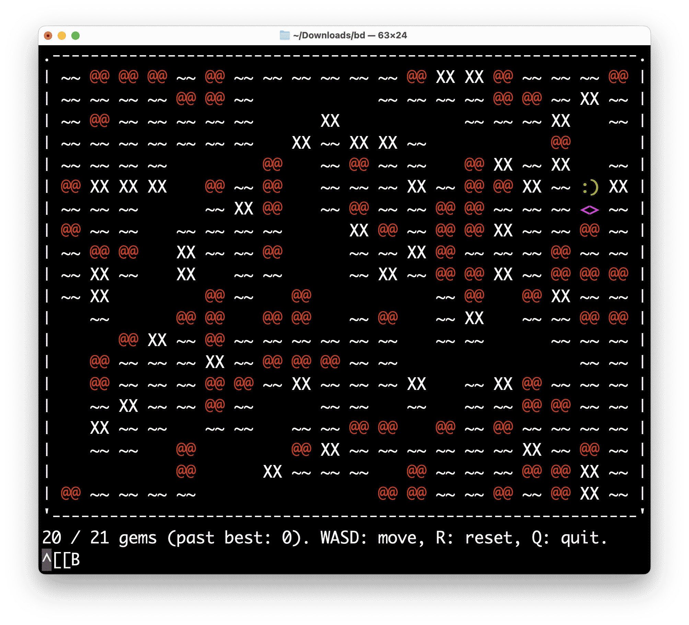

# Obfuscated C

This project's C code doesn't look much like C code. Not only that; once all the
macros are expanded the code is just a single statement in a `main` function. It
doesn't even use `?:` or the comma operator! And yet it compiles without any
warnings and runs a workable (if very limited) game of
[boulder dash](<https://en.wikipedia.org/wiki/Boulder_Dash_(video_game)>). How
does it branch? How does it loop? How does it store variables and allocate
memory? How is it able to work at all?

This silly C project was inspired by an
[anonymous 2005 entry](https://www.ioccc.org/2005/anon/) to the
[International Obfuscated C Code Contest](https://www.ioccc.org/). The original
idea --- "Memory Allocated by Stack Smashing" --- comes from that entry; I've
just extended some concepts and built a more complicated game on top.

## Files

[&#x2B07;&#xFE0F; download all](bd.zip)

<details><summary>bd.c</summary>

<!-- prettier-ignore -->
```c
// This uses ANSI codes to colour the output.
// If your terminal does not support ANSI codes, define NO_TERM_COLS at build time

#include "lang.h"
#include "vars.h"

// Print helpers (with/without ANSI codes)
#ifdef NO_TERM_COLS
#  define put(f,m) do printf(m " ")
#  define reset_cursor
#else
#  define put(f,m) do printf(f m DEF " ")
#  define reset_cursor do printf("\x1b[%dF",height+5)
#endif

// Initialise memory and call init
run(vars, init)

function(init) (
	if (depth > vars + 1) (
		if (scratch) (
			do wincount = 0
			do best = 0
		)
		do storage2 = size / 5
		do storage3 = size / 10
		do allgems = wincount * 3 + size / 20 + 1
		if (allgems + storage2 + storage3 + 1 > size) (
			do allgems = size / 20 + 1
		)
		do player_x = width / 2
		do player_y = height - 1
		do storage = 0
		do gems = allgems
		do dead = 0
		for (loop_init, size)
		goto(gameloop)
		if (gems > best) (
			do best = gems
		)
		if (gems >= allgems) (
			do wincount ++
		)
		if (dead == -3) (
			break
		) elif (dead != -2) (
			do printf(" (best: %d) Press any key to restart.\n", best)
			do getc(stdin)
		)
		do scratch = 0
		goto(init)
	) elif (argc == 3) (
		do width = atoi(argv[1])
		do height = atoi(argv[2])
		do size = width * height
		do scratch = 1
		if (size > 1000) (
			do printf("\nLarge grid, continue? (y/n) ")
			if (getc(stdin) != 'y') (
				do printf("\nTry 20x20.\n")
				break
			)
		)
		goto(init with size)
		do printf(" Bye.\n")
	) else (
		do printf("Try:\n\t%s 20 20\n\n", argv[0])
	)
)

function(gameloop) (
	do printf("\n\n")
	if (p) (
		do map_at_player_offset(0, 0) = empty
		switch (p) (
			case (1)
				do player_y --
				break
			case (2)
				do player_x --
				break
			case (3)
				do player_y ++
				break
			case (4)
				do player_x ++
				break
		)
		switch (map_at_player_offset(0, 0)) (
			case (gem)
				do gems ++
				break
			case (rock)
				do map_at_player_offset((p == 4) * 2 - 1, 0) = rock
				break
		)
		do map_at_player_offset(0, 0) = player
		goto(gravity)
	)

	do storage2 = (
		player_x > 0 &&
		(
			map_at_player_offset(-1, 0) is soft ||
			(
				map_at_player_offset(-1, 0) == rock &&
				player_x > 1 &&
				map_at_player_offset(-2, 0) == empty
			)
		)
	)
	do storage3 = (
		player_x < width - 1 &&
		(
			map_at_player_offset(1, 0) is soft ||
			(
				map_at_player_offset(1, 0) == rock &&
				player_x < width - 2 &&
				map_at_player_offset(2, 0) == empty
			)
		)
	)

	if (!dead) (
		if (
			!storage2 &&
			!storage3 &&
			!(player_y > 0 && map_at_player_offset(0, -1) is soft) &&
			!(player_y < height - 1 && map_at_player_offset(0, 1) is soft)
		) (
			do dead = 2
		) elif (gems == allgems) (
			do dead = -1
		)
	)

	goto(drawmap)

	switch (dead) (
		case (-1)
			do printf("All %d Gems Collected! ", gems)
			break
		case (2)
			do printf("Stuck!   Final gems: %d", gems)
			break
		case (1)
			do printf("Crushed! Final gems: %d", gems)
			break
		default
			do printf("%d / %d gems (past best: %d). WASD: move, R: reset, Q: quit.\n", gems, allgems, best)
			do storage = 0
			switch (getc(stdin)) (
				case (27)
					if (getc(stdin) == 91) (
						switch (getc(stdin)) (
							case (65)
								do storage = 1
								break
							case (68)
								do storage = 2
								break
							case (66)
								do storage = 3
								break
							case (67)
								do storage = 4
								break
						)
					)
					break
				case (239)
					if (getc(stdin) == 156) (
						switch (getc(stdin)) (
							case (128)
								do storage = 1
								break
							case (130)
								do storage = 2
								break
							case (129)
								do storage = 3
								break
							case (131)
								do storage = 4
								break
						)
					)
					break
				case ('w')
					do storage = 1
					break
				case ('a')
					do storage = 2
					break
				case ('s')
					do storage = 3
					break
				case ('d')
					do storage = 4
					break
				case ('r')
					do storage = -1
					break
				case ('q')
					do storage = -2
					break
			)
			switch (storage) (
				case (-1)
					do dead = -2
					do printf("\rReset.")
					break
				case (-2)
					do dead = -3
					do printf("\rQuit.")
					break
				case (1)
					reset_cursor
					goto(gameloop with 1 * (player_y > 0 && map_at_player_offset(0, -1) is soft))
					break
				case (2)
					reset_cursor
					goto(gameloop with 2 * storage2)
					break
				case (3)
					reset_cursor
					goto(gameloop with 3 * (player_y < height - 1 && map_at_player_offset(0, 1) is soft))
					break
				case (4)
					reset_cursor
					goto(gameloop with 4 * storage3)
					break
				default
					reset_cursor
					goto(gameloop)
					break
			)
			break
	)
)

function(drawmap) (
	do printf(".-")
	for (loop_drawx2, width)
	do printf(".\n")
	for (loop_drawy, height)
	do printf("'-")
	for (loop_drawx2, width)
	do printf("'\n")
)

function(gravity) (
	for (loop_gravx, width)
)

lambda(loop_gravx) (
	do storage = p
	for (loop_gravy, height - 1)
)

lambda(loop_gravy) (
	do storage2 = mapcoord(storage, p)
	if (var(storage2) == rock && var(storage2 + width) == empty) (
		for (loop_gravy2, height - p - 1)
	)
)
lambda(loop_gravy2) (
	switch (var(storage2 + width)) (
		case (empty)
			do var(storage2) = empty
			do var(storage2 + width) = rock
			do storage2 += width
			break
		case (player)
			do dead = 1
			break
	)
)

lambda(loop_drawy) (
	do storage = height - p - 1
	do printf("| ")
	for (loop_drawx, width)
	do printf("|\n")
)

lambda(loop_drawx) (
	switch (map_at(width - p - 1, storage)) (
		case (player)
			switch (dead) (
				case (-1)
					put(T_ME, ":D")
					break
				case (2)
					put(T_ME, ":S")
					break
				case (1)
					put(T_ME, ":(")
					break
				default
					put(T_ME, ":)")
					break
			)
			break
		case (empty)
			do printf("   ")
			break
		case (soil)
			do printf("~~ ")
			break
		case (gem)
			put(T_GEM, "<>")
			break
		case (rock)
			put(T_ROCK, "@@")
			break
		case (wall)
			do printf("XX ")
			break
	)
)

lambda(loop_drawx2) (
	do printf("---")
)

lambda(loop_init) (
	if (mapcoord(player_x, player_y) == mapindex(p)) (
		do var(mapindex(p)) = player
		do storage = 1
	) else (
		do scratch = rand() % (p + storage)
		if (scratch < storage2) (
			do var(mapindex(p)) = rock
			do storage2 --
		) elif (scratch < storage2 + storage3) (
			do var(mapindex(p)) = wall
			do storage3 --
		) elif (scratch < storage2 + storage3 + gems) (
			do var(mapindex(p)) = gem
			do gems --
		) else (
			do var(mapindex(p)) = soil
		)
	)
)

eof
```

</details>

<details><summary>vars.h</summary>

<!-- prettier-ignore -->
```c
// Constants
#define player 0
#define empty  1
#define soil   2
#define gem    3
#define rock   4
#define wall   5

#define T_ME   "\x1b[33;1m"
#define T_GEM  "\x1b[35;1m"
#define T_ROCK "\x1b[31m"
#define DEF    "\x1b[0m"

// Variables
#define size     var(0)
#define width    var(1)
#define height   var(2)
#define storage  var(3)
#define storage2 var(4)
#define storage3 var(5)
#define scratch  var(6)
#define player_x var(7)
#define player_y var(8)
#define allgems  var(9)
#define gems     var(10)
#define best     var(11)
#define wincount var(12)
#define dead     var(13)
#define vars     14

// Helpers
#define mapindex(x)               (vars+(x))
#define mapcoord(x,y)             (vars+(y)*width+(x))
#define map_at(x,y)               var(mapcoord(x,y))
#define map_at_player_offset(x,y) map_at(player_x+(x),player_y+(y))
#define is
#define soft <rock

// Pseudo-enum
#define init        0x010000
#define gameloop    0x020000
#define drawmap     0x030000
#define gravity     0x040000
#define loop_init   0x100000
#define loop_drawy  0x200000
#define loop_drawx  0x300000
#define loop_drawx2 0x400000
#define loop_gravx  0x500000
#define loop_gravy  0x600000
#define loop_gravy2 0x700000
```

</details>

<details><summary>lang.h</summary>

<!-- prettier-ignore -->
```c
// Headers
#include <stdio.h>  // printf, getc
#include <stdlib.h> // atoi, srand, rand, system
#include <time.h>   // time

// Prototypes
int main(int v, char **s)

// Shorthand
#define run(allocSize,entryMethod){return 0&(!METHOD&&(v=(-STACK_OFFSET&0xFFF)<<8|v&0xFF)&&!main(entryMethod|allocSize+3,(char**)&v)\
ELIF(METHOD==entryMethod&&p)1|(!STACK_FRAME_DELTA&&1|(ENV|=STACK_OFFSET<<20)&&1|system("stty -icanon 2>/dev/null")\
ELIF(STACK_OFFSET/STACK_FRAME_DELTA==2)(N(void,(unsigned int),srand,((unsigned int)time(0)))))&&!main(v-1,s)
#define var(x)(*(int*)((size_t)s+(size_t)STACK_FRAME_DELTA*(size_t)((x)+3)))
#define argv ((char**)((size_t)s+(size_t)(ENV>>8&0xFFF)))
#define case(x))&&(ACTIVE=1))|1&&(ACTIVE&&(ACTIVE==1||SWITCH==(x))&&(1
#define n(r,q)(*(r(**)q)((size_t)&s-(size_t)STACK_FRAME_DELTA))
#define N(r,q,f,x)(n(void,q)=&f)&&n(int,q)x
#define STACK_OFFSET ((int)(size_t)&v-(int)(size_t)s)
#define METHOD ((unsigned int)v&0xFFFF0000)
#define S(x)do((ACTIVE=2)&&(0 x)))&&(ACTIVE=1
#define for(y,x)if(x)(goto(y|x-1))
#define L(x)F(x if(p)(goto(v-1)))
#define function(x)ELIF(METHOD==x)F
#define goto(x)do main((x),s)
#define F(x)((ACTIVE=1)x)|1&&(ACTIVE=1)
#define lambda(x)ELIF(METHOD==x)L
#define default ))|1&&(ACTIVE&&(1
#define switch(x)do SWITCH=x S
#define elif(x)ELIF(x)I
#define ELIF(x)||(x)&&
#define if(x)do(x)&&I
#define break )&&(ACTIVE=0
#define depth (STACK_OFFSET/STACK_FRAME_DELTA-3)
#define else(x)||I(x)
#define do )&&ACTIVE&&1|(
#define argc (ENV&0xFF)
#define p (v&0xFFFF)
#define ENV *(int*)s
#define SWITCH var(-1)
#define ACTIVE var(-2)
#define STACK_FRAME_DELTA (ENV>>20)
#define I(x)(1 x)
#define with )|(
#define eof );}
```

</details>

Build as normal, e.g.:

```sh
gcc -std=c99 -Wall -Wextra -Weverything -pedantic -O3 -o bd bd.c
```

(from the zip, you can just run `./build.sh`)

And run with:

```sh
./bd 20 20
```



## Platform support

This makes a big assumption about memory layout. Specifically, it assumes that
it can access stack space and that stack space is allocated linearly, with fixed
deltas between each frame. This is true for most hardware environments, but not
true for targets such as emscripten (so no WebAssembly compilation for this
madness). It also assumes that the `argv` data will be close to the initial
stack frame (within 4096 bytes), which may be less portable.

## Huh?

There are a few bizarre behaviours behind-the-scenes of this "language":

- The only way to allocate memory is to recursively call the main function and
  abuse the stack
- The only way to iterate is to recursively call the main function
- Loops are defined as separate lambdas, not inline, and all functions and
  lambdas actually behave like a large switch/case statement (which is why they
  need unique numeric values defined in `vars.h`)
- All branching is handled by short-circuiting `&&` and `||` operators
- The macros in `lang.h` abstract all this mess into a pseudo-language
- The "prototype" for `main` in `lang.h` is not a prototype at all!

## Background

The [inspiration](https://www.ioccc.org/2005/anon/) for this project showed that
it was possible to build a functional program using a single statement within a
single function, combined with recursion. But it had a few drawbacks. Most
notably: the whole stack memory was clobbered, including the return address for
frames, so the function could never return. This meant every operation grew the
stack until the program crashed. Also because it was for an _obfuscated_ code
contest, the syntax of the invented language was not very clear, and the program
itself was quite basic due to the competition's file size limit.

I wanted to build a more useable grammar around the same concepts, then use this
grammar for a more complex test program. I also wanted to avoid (or at least
reduce) the issue with stack space being exhausted. I achieved that by only
mutating the `argc` value on each stack frame. This leads to more initial
recursion since each call only provides space for a single value, but being able
to return from `main` means the stack grows very, very slowly once the program
is running. It will eventually run out of stack space, but you would need to
play a _lot_ of levels to get there!

## Language reference

The language defined in `lang.h` works like so:

- `run(allocSize, entryMethod)` this defines the main entry point of the program
  and ensures there is enough available memory for the given number of variables
  (plus some extra space for internal variables). Internally it recursively
  calls `main` until the stack space is large enough, seeds the random number
  generator, then invokes the requested entry method.
- `function(id) ( code )` this defines a function which can be marked as the
  entry function, or called later using `goto`. Function IDs should be within
  the mask value `0xFFFF0000` (i.e. must not set the lower 16 bits of data), but
  have no other restrictions.
- `goto(function_id)` jumps to the requested function, then returns to the next
  instruction when the function completes. Internally this translates to a
  recursive `main` call with the function ID in `argc`.
- `goto(function_id with parameter)` same as `goto` but also sets a single
  parameter for the called function (this parameter defaults to 0 if `with` is
  not used). The value is available to the function as `p` (which is simply
  `argc & 0x0000FFFF`; internally the function ID and parameter value are
  combined and passed as `argc`)
- `lambda(id) ( code )` like `function`, but adds code for looping using
  recursion. This is used with `for`.
- `for(lambda_id, iterations)` convenience wrapper for looping; this invokes the
  given lambda if `iterations` is greater than 0. Each invocation of lambda will
  see the loop counter variable in `p`, counting _down_ from `iterations-1` to
  `0`. Because `lambda` contains code for recursing, it will automatically
  perform the full loop. Once the loop completes, any code below the `for` will
  run as normal.
- `do` denotes a section of regular code, akin to a statement. It will execute
  the statement if the program flow is not marked as stopped (e.g. by the use of
  a `break` statement). `do` can be chained, and behaves in a similar manner as
  semicolons (but as a prefix rather than suffix).
- `var(id)` returns a reference to the requested variable. The ID acts as an
  index in the memory list, where each entry occupies one stack frame (the exact
  process is described below).
- `if (condition) ( code ) elif (condition) ( code ) else ( code )` behaves like
  a standard if/else-if/else chain. The `else` is optional and there can be any
  number of `elif` branches. Internally this uses the short-circuting behaviour
  of `&&` and `||`, and exploits the fact that `&&` has higher precedence than
  `||`; with `&&` used for conditional execution and `||` used for "else". `if`
  statements can be nested.
- `switch (variable) ( case (value) commands break )` behaves like a typical
  switch statement; there can be many `case`s, and fall-through is supported.
  There can also be a `default`. Internally this uses a hidden variable `SWITCH`
  to store the given value, and a hidden marker variable `ACTIVE` to detect
  whether execution is allowed to continue for a particular block, or has been
  stopped with a `break` (this allows, for example, conditional `break`ing).
  `switch` statements can be nested.
- `eof` appears at the end of the file. Internally this closes the generated
  `main` method, and writes the only semicolon in the source.

Variables are stored by overwriting `argv` parameters in early stack frames
(because other locations such as return addresses are not touched, it is safe
for function calls to return). The `argv` parameter of all invocations begins
set to a pointer to the first `argv` parameter, which stores the delta between
subsequent variables (this enables support for stacks which grow positively and
negatively). With these two pieces of information, it is possible to locate any
variable by index in the stack space. There are a few "hidden" variables stored
at negative offsets which are used for internal management (e.g. maintaining the
value of a `switch` statement). The macro `depth` can be used to find the
current variable count limit, which can be used (as in the boulder dash demo) to
allocate dynamic amounts of memory (the actual game loop will only begin once
the depth is enough for the requested grid size).

Internal value indices:

- `-3` (`ENV`) contains `argc` (rightmost 8 bits), `argv` (next 12 bits, as an
  offset in `sizeof(void*)`), and `STACK_FRAME_DELTA` (the memory delta between
  stack frames, using all remaining bits).
- `-2` (`ACTIVE`) contains a flag for determining current execution state, as
  used by the `switch` / `case` / `break` statements.
- `-1` (`SWITCH`) contains the current `switch` statement's value. This gets
  overwritten with nested statements, but as the matching outer `case` must
  already have been found in such situations, it is not a problem.

Perhaps this language will take off and become the next Python? &#x1F91E;

## But seriously

The [IOCCC](https://www.ioccc.org/) is a gem of crazy, creative things that are
possible when the standard rules are thrown away. If you write software, please
take a look at some of the other entries to their competitions (and if you don't
write software, why are you reading this article?).

In a similar vein, the [Underhanded C Contest](https://www.underhanded-c.org/)
has lots of entries showing how subtle language features can cause unexpected
(or at least non-obvious) behaviours.

These techniques have no place in professional (or even amateur) software, but
studying and understanding them is a great way to get a deeper knowledge of how
programs operate at lower levels, and shines a light on parts of the language
which can be confusing and are potentially the source of bugs in real
applications. Every language has gotchas, and giving ourselves a bit of time to
play with them can give us insights which make us better at debugging, better at
comprehending unfamiliar and unusual code, and all-round better software
engineers.
