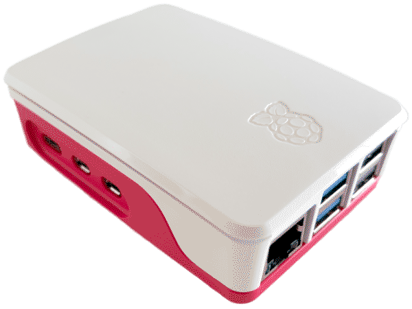

# Raspberry Pi Ethernet Switching

The [Raspberry Pi](https://www.raspberrypi.com/) is a surprisingly capable
device for offloading tasks to. I have one which is primarily used for running
[Docker images](https://hub.docker.com/). It spends most of its time sitting in
the router cupboard connected directly via Ethernet, but sometimes it comes out
to be connected to a screen or go travelling. At these times it has to use Wi-Fi
instead.



## The problem with Pi Wi-Fi

The Pi's built-in Wi-Fi connectivity is fast, but occasionally laggy, especially
if there is a delay between packets. This is presumably due to the Wi-Fi chip
entering a "sleep" mode or similar. Whatever the cause, it can be quite
disruptive to SSH sessions. Here's a ping dump connecting from my laptop to the
Pi over Wi-Fi, with 10 second intervals between each ping:

> ```
> $ ping -i 10 -c 10 mypi.local
> PING mypi.local (192.168.0.5): 56 data bytes
> 64 bytes from 192.168.0.5: icmp_seq=0 ttl=64 time=3.158 ms
> 64 bytes from 192.168.0.5: icmp_seq=1 ttl=64 time=10.868 ms
> 64 bytes from 192.168.0.5: icmp_seq=2 ttl=64 time=62.133 ms
> 64 bytes from 192.168.0.5: icmp_seq=3 ttl=64 time=92.364 ms
> 64 bytes from 192.168.0.5: icmp_seq=4 ttl=64 time=10.043 ms
> 64 bytes from 192.168.0.5: icmp_seq=5 ttl=64 time=49.769 ms
> 64 bytes from 192.168.0.5: icmp_seq=6 ttl=64 time=10.035 ms
> 64 bytes from 192.168.0.5: icmp_seq=7 ttl=64 time=5.964 ms
> 64 bytes from 192.168.0.5: icmp_seq=8 ttl=64 time=38.031 ms
> 64 bytes from 192.168.0.5: icmp_seq=9 ttl=64 time=72.179 ms
>
> --- mypi.local ping statistics ---
> 10 packets transmitted, 10 packets received, 0.0% packet loss
> round-trip min/avg/max/stddev = 3.158/35.454/92.364/30.528 ms
> ```

Notice the maximum round-trip time reported is 92ms! This is very slow for a
local network, even over Wi-Fi, and the times are also wildly
inconsistent[^rapid-wifi].

## Faster over Ethernet

Connecting the Pi to the router via ethernet improves this substantially, even
if the laptop still connects to the router via Wi-Fi:

> ```
> $ ping -i 10 -c 10 mypi.local
> PING mypi.local (192.168.0.11): 56 data bytes
> 64 bytes from 192.168.0.11: icmp_seq=0 ttl=64 time=6.000 ms
> 64 bytes from 192.168.0.11: icmp_seq=1 ttl=64 time=7.159 ms
> 64 bytes from 192.168.0.11: icmp_seq=2 ttl=64 time=7.399 ms
> 64 bytes from 192.168.0.11: icmp_seq=3 ttl=64 time=7.136 ms
> 64 bytes from 192.168.0.11: icmp_seq=4 ttl=64 time=7.057 ms
> 64 bytes from 192.168.0.11: icmp_seq=5 ttl=64 time=7.420 ms
> 64 bytes from 192.168.0.11: icmp_seq=6 ttl=64 time=3.060 ms
> 64 bytes from 192.168.0.11: icmp_seq=7 ttl=64 time=4.972 ms
> 64 bytes from 192.168.0.11: icmp_seq=8 ttl=64 time=7.373 ms
> 64 bytes from 192.168.0.11: icmp_seq=9 ttl=64 time=3.285 ms
>
> --- mypi.local ping statistics ---
> 10 packets transmitted, 10 packets received, 0.0% packet loss
> round-trip min/avg/max/stddev = 3.060/6.086/7.420/1.631 ms
> ```

Much more consistent! There's still a bit of latency, but it's not fluctuating
up to crazy numbers any more[^rapid-ethernet].

But there's a problem: by default, the Pi will connect to _all available
networks_ and advertise its hostname to all of them. When it is attached to a
network over _both_ Wi-Fi _and_ Ethernet, it doesn't know that both are going to
the same place, and it is effectively random which route will be used when
communicating by hostname. If the Wi-Fi route is chosen, we get the same
connectivity issues even though we could just as well have used Ethernet.

## Picking a favourite

The [`nmcli`] (Network Manager CLI) command can show us the Pi's networking
preferences:

```sh
nmcli --fields AUTOCONNECT-PRIORITY,NAME connection
```

Which prints something like:

> ```
> AUTOCONNECT-PRIORITY  NAME
> 0                     netplan-eth0
> 0                     my-wifi-network
> 0                     lo
> 0                     docker0
> ```

We might expect to be able to use these "autoconnect priority" settings to
prefer Ethernet over Wi-Fi, by running either of these commands:

```sh
sudo nmcli connection modify "netplan-eth0" connection.autoconnect-priority 1
# or
sudo nmcli connection modify "my-wifi-network" connection.autoconnect-priority -1
```

But **this does not actually work**: the autoconnect priority only applies
within the same device (e.g. between multiple available Wi-Fi networks); it
doesn't apply across multiple devices (e.g. Wi-Fi and Ethernet).

## An actual solution

Instead, we can take a more drastic approach: disabling / enabling the entire
Wi-Fi feature automatically when an Ethernet cable is connected / removed:

```sh
sudo tee /etc/NetworkManager/dispatcher.d/10-prefer-ethernet >/dev/null <<"EOF"
#!/bin/sh
if [ "$2" = "up" ] || [ "$2" = "down" ]; then
  if nmcli --fields type connection show --active | grep ethernet; then
    nmcli radio wifi off
  else
    nmcli radio wifi on
  fi
fi
EOF
sudo chmod 0744 /etc/NetworkManager/dispatcher.d/10-prefer-ethernet
sudo systemctl restart NetworkManager
```

This sets up a network callback which automatically disables Wi-Fi when Ethernet
is connected, and turns it back on when disconnected. This happens live, so the
Pi will not only configure itself correctly when first switched on, but also
automatically (and immediately) reconfigure if the setup changes.

One thing to watch out for: if you are connected to the Pi over Wi-Fi then plug
it in to Ethernet, your existing connection will be lost (due to Wi-Fi being
switched off).

## Bluetooth interactions

The Pi (like most devices with embedded radio) uses the same component for both
Wi-Fi _and_ Bluetooth connectivity. Personally, I don't need Bluetooth on the Pi
at all (since I only connect to it via SSH from my computer rather than using
any peripherals like a wireless keyboard), so I typically turn it off with:

```sh
echo 'dtoverlay=disable-bt' | sudo tee -a /boot/firmware/config.txt >/dev/null
```

But it turns out this is a **very bad idea** when using Wi-Fi! Let's take a look
at the Wi-Fi ping statistics when Bluetooth is disabled:

> ```
> $ ping -i 10 -c 10 mypi.local
> PING mypi.local (192.168.0.5): 56 data bytes
> 64 bytes from 192.168.0.5: icmp_seq=0 ttl=64 time=7.152 ms
> 64 bytes from 192.168.0.5: icmp_seq=1 ttl=64 time=1364.511 ms
> 64 bytes from 192.168.0.5: icmp_seq=2 ttl=64 time=372.445 ms
> 64 bytes from 192.168.0.5: icmp_seq=3 ttl=64 time=402.857 ms
> 64 bytes from 192.168.0.5: icmp_seq=4 ttl=64 time=637.891 ms
> 64 bytes from 192.168.0.5: icmp_seq=5 ttl=64 time=9.875 ms
> 64 bytes from 192.168.0.5: icmp_seq=6 ttl=64 time=1826.176 ms
> 64 bytes from 192.168.0.5: icmp_seq=7 ttl=64 time=1037.947 ms
> 64 bytes from 192.168.0.5: icmp_seq=8 ttl=64 time=165.597 ms
> 64 bytes from 192.168.0.5: icmp_seq=9 ttl=64 time=10.126 ms
>
> --- mypi.local ping statistics ---
> 10 packets transmitted, 10 packets received, 0.0% packet loss
> round-trip min/avg/max/stddev = 7.152/583.458/1826.176/600.458 ms
> ```

The maximum round-trip has shot up to nearly 2 seconds!

As noted in the introduction, this is probably because the chip is entering a
"sleep" mode from inactivity, and takes some time to wake up.

So when Wi-Fi is being used, it's definitely better to keep Bluetooth powered on
to avoid the worst of the latency. We can at least disable the software side of
things if we're not using it, to save a few system resources:

```sh
systemctl disable --now bluetooth
```

It would be nice to be able to fully power it down when Ethernet is connected,
but I don't know of a way to do that without a restart.

## Only Ethernet

The fixes above assume you have a Pi which is set up to connect to Wi-Fi, and
you want a more reliable connection when using Ethernet. If you _only_ want
Ethernet, you can simply turn off Wi-Fi entirely with:

```sh
echo 'dtoverlay=disable-wifi' | sudo tee -a /boot/firmware/config.txt >/dev/null
```

Or disable both Wi-Fi and Bluetooth:

```sh
echo 'dtoverlay=disable-bt,disable-wifi' | sudo tee -a /boot/firmware/config.txt >/dev/null
```

## Further reading

Thanks to
[Network Manager example #15](https://networkmanager.dev/docs/api/latest/nmcli-examples.html#id-1.2.7.6.16)
for the main solution in this article.

- [Network Manager CLI documentation](https://networkmanager.dev/docs/api/latest/nmcli.html)
- [Network Manager connection settings](https://networkmanager.dev/docs/api/latest/settings-connection.html)

[^rapid-wifi]:
    The situation is not so bad when using rapid pings over the same total
    timespan:

    > ```
    > $ ping -i 0.1 -c 1000 mypi.local
    > PING mypi.local (192.168.0.5): 56 data bytes
    > [...]
    >
    > --- mypi.local ping statistics ---
    > 1000 packets transmitted, 1000 packets received, 0.0% packet loss
    > round-trip min/avg/max/stddev = 3.186/6.810/18.955/0.935 ms
    > ```

[^rapid-ethernet]: And again, if we use rapid pings we see better results:

    > ```
    > ping -i 0.1 -c 1000 mypi.local
    > PING mypi.local (192.168.0.11): 56 data bytes
    > [...]
    >
    > --- mypi.local ping statistics ---
    > 1000 packets transmitted, 1000 packets received, 0.0% packet loss
    > round-trip min/avg/max/stddev = 2.657/3.586/7.955/0.452 ms
    > ```

[`ping`]: https://manpages.debian.org/trixie/inetutils-ping/ping.1.en.html
[`nmcli`]: https://networkmanager.dev/docs/api/latest/nmcli.html
[`systemctl`]: https://manpages.debian.org/trixie/systemd/systemctl.1.en.html
