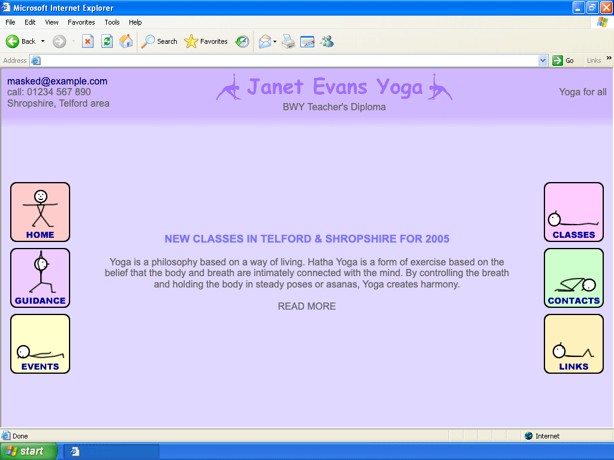
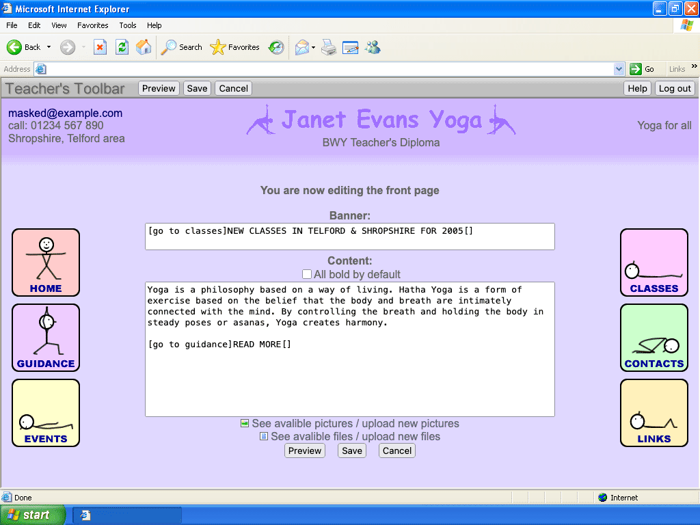
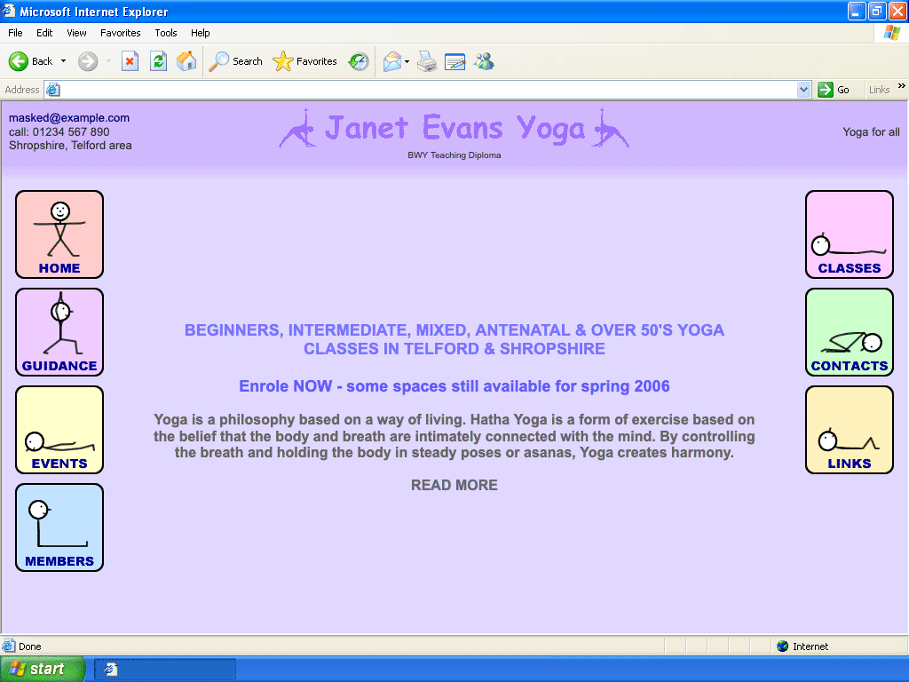
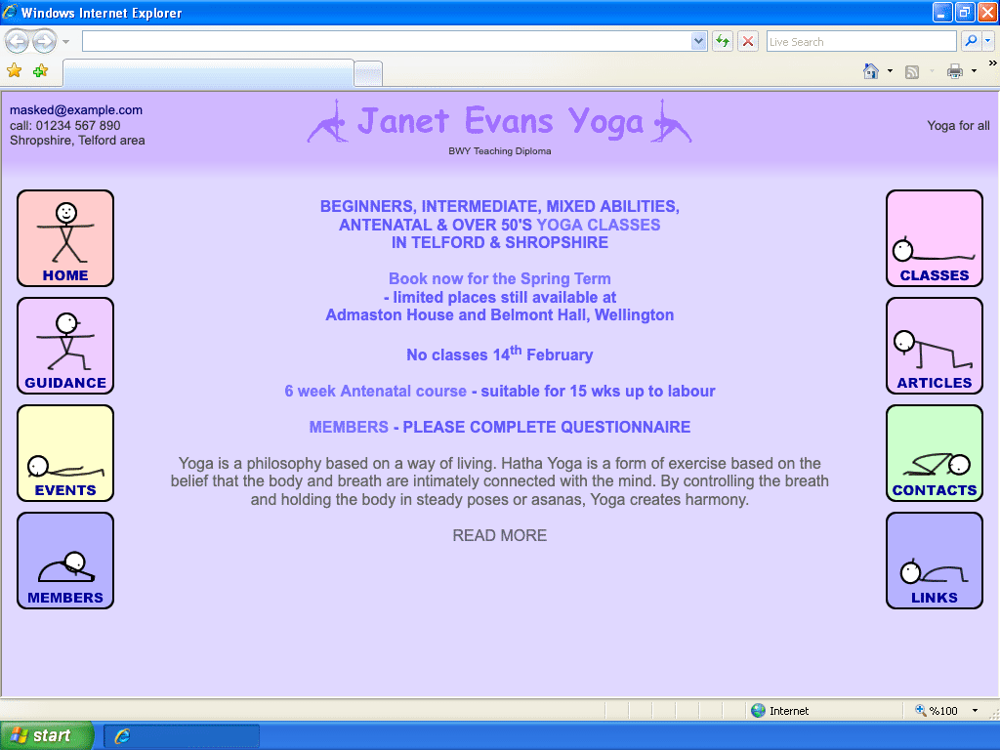
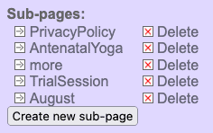
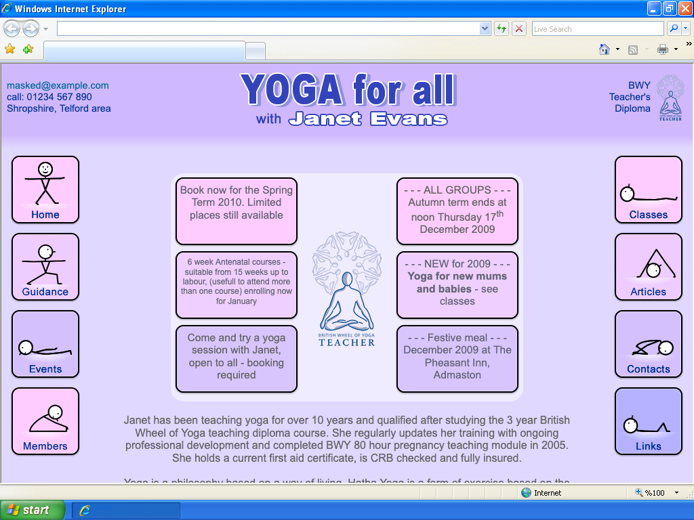
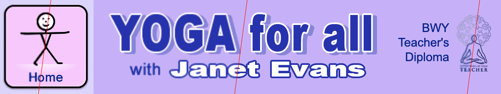
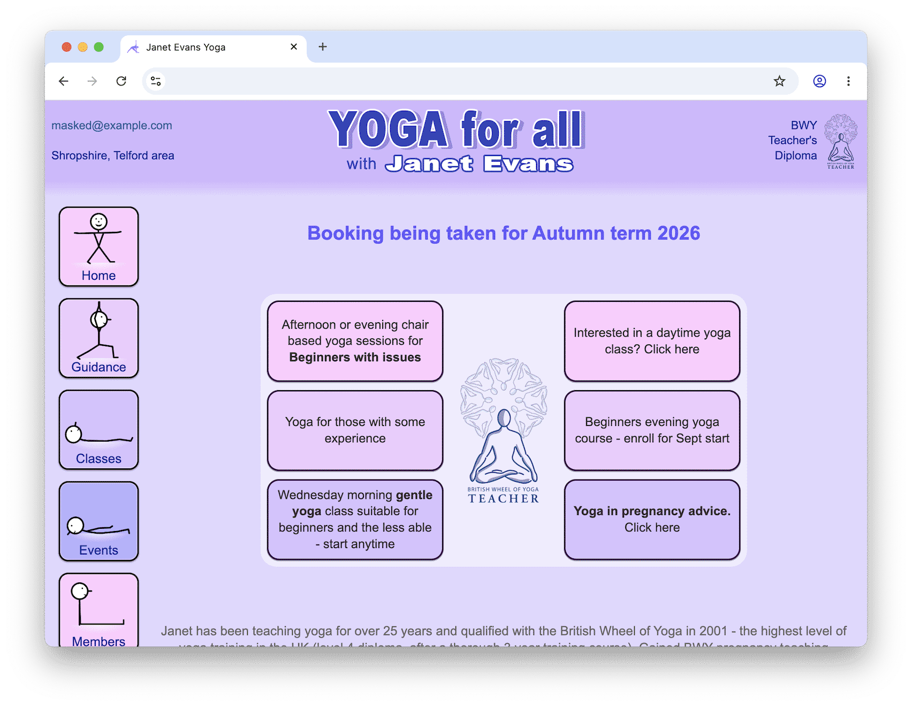

# An Archæological Dig Into Childhood HTML and PHP

Back in December 2003, my self-employed mum needed a website to advertise her
local yoga classes. As a then-14-year-old computer nerd with some coding
experience, I was the obvious choice to build it.

I've been maintaining that website ever since, making it my longest running
project. It's been online and actively used for almost two thirds of the
lifetime of the Internet; it's older than YouTube, Reddit, and
Facebook[^spacejam]. So in this article I'm going to look back over the history
of the site, how the Internet itself has changed, and review the terrible (and
occasional not so terrible!) choices my untrained younger self made.

## December 2003: Minimum Viable Product

First let's set the scene. The Internet was a different place in 2003: Internet
Explorer was
[at peak popularity](https://en.wikipedia.org/wiki/File:Internet-explorer-usage-data.svg),
with over 90% of the market share (versions 5 and 6!) having recently killed off
[Netscape Navigator](https://en.wikipedia.org/wiki/Netscape_Navigator) via
[illegal business practices](https://en.wikipedia.org/wiki/United_States_v._Microsoft_Corp.);
the mobile Internet was only just getting started, and was limited to
[basic text and image content](https://en.wikipedia.org/wiki/Wireless_Application_Protocol)
where it was available at all (the iPhone
[wouldn't be released until 2007](https://en.wikipedia.org/wiki/IPhone#Models),
and wouldn't even begin development until the next year);
[MySpace](https://en.wikipedia.org/wiki/Myspace) was on the up, and
[Facebook](https://en.wikipedia.org/wiki/Facebook) hadn't been written yet.
HTTPS
[had just been published in 2000](https://datatracker.ietf.org/doc/html/rfc2818),
cost a lot of money, and was
[only for banks and payment platforms](https://www.jefftk.com/p/history-of-https-usage).
In my household: we got online with a
[56k modem](https://en.wikipedia.org/wiki/Modem#56_kbit/s_technologies), and you
had to ask everybody not to use the house phone.

My knowledge of HTML and CSS came from Elizabeth Castro's O'Reilly book
[HTML for the World Wide Web (5th Edition)](https://www.oreilly.com/library/view/html-for-the/0321130073/),
which had been published the previous year. This was about as up-to-date as I
could get; [MDN](https://en.wikipedia.org/wiki/MDN_Web_Docs) wouldn't exist for
another 2 years, and
[Stack Overflow](https://en.wikipedia.org/wiki/Stack_Overflow) wouldn't exist
until 2008.

So I built a simple site. It had 7 pages, it was in my mum's favourite colour,
and it gave people all the details they needed on what classes she offered,
where they were, and how to book.


The original version of my mum's site, looking roughly as it would have back
when it was made.

Yes, the title is in Comic Sans. And yes, the other fonts are a mix of Serif,
Sans-Serif, and even Monospace! No, I have no regrets.

Computer screens were 1024&times;768 _if you were lucky_, and back then the
browser menu, toolbars, status bar, and the Windows XP start bar ate a lot of
that space even if the user had their browser maximised[^toolbars], so looking
back I think this was a pretty clean overall design, minus me stealing 30 pixels
at the bottom to advertise myself. Everything is clear, has plenty of space, and
the important information is front-and-centre. Unless the user has a truly tiny
screen, everything fits without scrolling. All my mum's classes are listed, with
times, locations, and convenient links to send pre-composed emails for booking.
It even has fun little stick figures doing yoga poses which would flip between
positions when you put the mouse on them! These figures were based on diagrams
my mum drew in her lesson plans, and became a big part of her brand; I helped
her make posters (and a few hundred tote bags) featuring them.

My silly advert at the bottom links to an old
[Hotmail](https://en.wikipedia.org/wiki/Outlook.com#MSN_Hotmail) email address
([Gmail](https://en.wikipedia.org/wiki/Gmail) wasn't released until the next
year), and no: I never had anybody contact me from that.

The site was a success. My mum liked it, customers found it and booked lessons,
and it was cheap to run. By agile software development standards (which I knew
nothing about at the time), this was well and truly a Minimum Viable Product
(well, maybe the stick figures made it a _little_ more than the minimum).

### The Tech

I'll be looking at how this site has evolved in design, implementation, and
deployment over the years, but first let's take a look at this earliest
version's implementation to get a baseline. I haven't kept the code or assets
for it
([Git wouldn't be released until 2005](https://en.wikipedia.org/wiki/Git), even
[Subversion 1.0 wouldn't be released for a few more months](https://en.wikipedia.org/wiki/Apache_Subversion),
and young me had never heard of
[CVS](https://en.wikipedia.org/wiki/Concurrent_Versions_System)), but I've
pieced it together from the backups I do have, with some help from the
[Wayback machine](https://web.archive.org/). The tech stack was:

- Static HTML +
  [framesets](https://developer.mozilla.org/en-US/docs/Web/HTML/Reference/Elements/frameset)
  (nostalgia!)
- Small bits of JavaScript
- A tiny bit of CSS
- Hosted on [1&1](https://en.wikipedia.org/wiki/1%261_AG)'s cheap-ish shared
  hosting[^1and1], which my dad & I were already using to host some hobby
  websites

If you're curious, you can
[download the whole site (approximately) as it was](./code-2003.zip) and take a
look at the code, which features a number of cringe-worthy errors; all the way
from repeated typos and spelling mistakes[^notepad] to complete
misunderstandings of how things work and various crimes against HTML.

### Features of the times

The Intenet of the early millennium was a weird and wild place. One of the
stranger practices was for some search engines and site directories to link not
directly to sites, but to a frameset which _embedded_ the site, alongside a
bunch of adverts. The defense: add some JavaScript to detect if the page was
loaded in a frame, and break out:

<!-- prettier-ignore -->
```js
if (top.location != self.location) {
 top.location.href="index.htm"
}
```

These days there are
[easier ways to prevent that](https://developer.mozilla.org/en-US/docs/Web/HTTP/Reference/Headers/Content-Security-Policy/frame-ancestors).

It was also a more trusting time: most search engines still trusted `<meta>`
tags embedded in pages, leading to "search engine optimisation" techniques of
packing them with keywords. In this site I'd done that in the banner frame (for
some crazy reason). Thankfully it featured code to do the opposite of the above:
to put itself back _into_ the main frameset if it was loaded on its own:

<!-- prettier-ignore -->
```js
if (top.location == self.location) {
 top.location.href="index.htm"
}
```

You may notice that this one _doesn't_ defend against being loaded in somebody
else's frameset. Oh well.

Finally, it was a time when many features which we think of as the most basic
things today simply did not exist. CSS's `:hover` selector did not exist in
Internet Explorer (JavaScript with `onmouseover` and `onmouseout` had to be used
instead). Grids and Flexbox wouldn't exist anywhere until about a decade later.
PNG images were often rendered with opaque backgrounds and had
[gamma-related issues](https://hsivonen.fi/png-gamma/). CSS in particular was
very much in its infancy, and to avoid problems in Internet Explorer 5, styling
was mostly done with HTML tags and attributes. Table-based layouts were the
norm.

Speaking of table-based layouts: that's what the banner is using. It hasn't
survived the test of time. As written, it renders like this:


The original banner as it appears in modern browsers.

### Playing with ~~fire~~ GIFs

Partly because of Internet Explorer's problems rendering PNGs, every image on
the site was a GIF. Young me was taking a gamble without knowing it: at the time
[Unisys was chasing after GIF users for patent royalties](https://en.wikipedia.org/wiki/GIF#Unisys_and_LZW_patent_enforcement)[^gif-png].
I was using
[Macromedia Fireworks MX](https://en.wikipedia.org/wiki/Adobe_Fireworks)[^fireworks]
(RIP), which could export both formats, but since I didn't know about the
patents and I knew that Internet Explorer's PNG handling was buggy, I went for
GIF. Fortunately it seems Unisys had bigger targets to chase after than my mum's
site, so we escaped those dark times unscathed.

## February 2005: Self-publishing

My mum's business took off! Which was great for her, but any time site changes
were needed (e.g. to add a new class or mark an existing class as full), I had
to edit the HTML, connect to the SFTP server, and upload the new file. By
February 2005, I'd spent a lot of time updating content like this, and that
wasn't how I wanted to spend my teenage years. I knew I had to give my mum a way
to edit the content herself. She was computer savy, but didn't know HTML and was
unlikely to handle the complexities of an SFTP client. It had to be a site which
my mum could edit _from her browser_.

Things had moved on a little in the meantime: Internet Explorer's success was
beginning to wane (in particular Internet Explorer 5 was much less used than 2
years earlier, and [Firefox](https://en.wikipedia.org/wiki/Firefox) came out of
beta), Subversion and Git were released (but I didn't know it), Facebook was
beginning to get users, and [WordPress](https://en.wikipedia.org/wiki/Wordpress)
1.0 was released. And some things were still to come:
[Markdown](https://daringfireball.net/projects/markdown/) had been created in
2004 but wasn't widely known yet, and the first public
[specification for JSON](https://www.json.org/) wouldn't be published for
another year.

I hadn't heard of WordPress, so I made the new editable website myself from
scratch. I knew some PHP, and 1&1's hosting supported it. I also took the
opportunity to give the site a small visual refresh:


Version 2 of the site.

Some things are nicer here (goodbye Serif text and silly advert), some things
are worse (hello poor contrast ratio and off-centre banner; changed because at
this point I'd seen how broken the original banner was in Firefox). The stick
figures have been updated to do a little 5-frame animation when hovered over,
instead of jumping between 2 images. The site navigation has also grown a bit.

At this point, if my mum wants to edit a page she can go to `/admin`, enter a
secret username and password (via
[Basic auth](https://en.wikipedia.org/wiki/Basic_access_authentication)... over
HTTP... with no rate-limiting... eek) to be logged in and redirected back to the
page, where she sees something like this:


A mockup of how editing would have looked in that first editable version of the
site. I don't have the code available, so this was created by "backporting" more
recent versions. In reality it might have been a bit more basic than this.

In some ways this is quite a nice user experience: after logging in as an admin,
it returns to the same page URL as before and displays an admin toolbar at the
top (based on a flag in the user session). This means my mum can stay logged in
all the time and share URLs with customers without needing to worry about them
being "internal". It's also a bit risky: the site didn't set any caching
headers, so if the hosting provider had used a caching proxy there's a very real
chance that admin content could leak out and be visible to regular visitors
(though thankfully they wouldn't be able to actually make any changes).

In the absence of Markdown, I'd invented my own not-HTML language for formatting
text, mostly built around square brackets. So `this is [b]bold[]` would
translate to `this is <b>bold</b>`, and `[go to guidance]click me[]` would
become something like `<a href="guidance.php">click me</a>`. I have no idea why
I thought this would be easier for my mum to learn than regular HTML (no WYSIWYG
editor for her!
[`contenteditable`](https://developer.mozilla.org/en-US/docs/Web/HTML/Reference/Global_attributes/contenteditable)
_did_ already exist in IE5.5 but I didn't know about it yet, which is probably
for the best). Technically there's nothing stopping her using HTML here though;
nothing gets escaped or sanitised, which I guess is similar to markdown's
philosophy of allowing raw HTML as an escape hatch.

I remember I made the "Teacher's Toolbar" look (a little bit) like a regular
toolbar, because I wanted it to be obvious that it wasn't part of the site that
visitors would see. That backfired slightly, because my mum ended up thinking it
had to be installed on any computer she wanted to edit the site from, but the
confusion was soon cleared up.

### The Tech

The frames have gone, replaced with a heavily nested table structure. And this
is no-longer static HTML. The new tech stack is:

- PHP (version 4 because that's what the 1&1 hosting supported) generating HTML
- A bit more JavaScript than before
- A lot more CSS than before (including a dedicated print stylesheet!)
- No database
- Still hosted on 1&1 (using their shared Apache server, with Basic Auth
  configured by a `.htaccess` file)

Sadly I don't have a copy of the backend code from this earliest version; the
oldest backup I have is from 2015, by which time it had already gained a lot of
features, and the oldest Wayback archive of the frontend is from later in 2005,
but the general structure of the code didn't change so it's broadly
representative of the original. I've put together a crude "backport" from these
later versions, removing features which I know didn't exist in the early days.
If you're interested in the details, you can
[download it here](./code-2005.zip). The HTML is valid now, but still pretty
horrific.

### Quirks of a young programmer

Young me hated wasteful data transfer, so used barely any whitespace at all (the
code examples here have had whitespace added). This extended to using minimal
(1--3 character) names throughout the PHP and JavaScript, making it somewhat
difficult to follow[^jsmin].

It also seems that I had no idea JavaScript allowed property access with syntax
like `document["Lnk"+ind]`, so I used `eval` (and strings passed to
`setTimeout`) to build hover-handling code dynamically for all the buttons.
There's no user input here so it's technically safe, but... \*shudder\*.

<!-- prettier-ignore -->
```js
function RO(ind) {
  if (MAc[ind] == 0)
    setTimeout("ROB(" + ind + ",1)", 100);
  MAc[ind] = 1
}

function ROB(ind, pos) {
  eval("document.Lnk" + ind + ".src='" + MAa[ind] + "" + pos + "." + MAb[ind] + "'");
  if (pos < 4)
    setTimeout("ROB(" + ind + "," + (pos + 1) + ")", 100)
}
```

Nor did I know how to use objects: the button data is stored in 3 separate
arrays, one per property: (this pattern also appears in the PHP code)

<!-- prettier-ignore -->
```js
MAa = new Array("Images/Buttons/Home", "Images/Buttons/Guid", "Images/Buttons/Even", "Images/Buttons/Clas", "Images/Buttons/Cont", "Images/Buttons/Link");
MAb = new Array("gif", "gif", "gif", "gif", "gif", "gif");
MAc = new Array(0, 0, 0, 0, 0, 0);
```

These aren't due to limitations of the day; just a young programmer not really
knowing what he was doing.

On the backend, each page exists as a dedicated `.php` file (because the hosting
provider did not support "catch-all" handlers), but the files themselves are
minimal. For example `links.php` contains:

```php
<?php include_once('s_gen.php');Complete('links');?>
```

I can live with that! If I had the same restrictions today I'd probably do
something similar (though of course I'd first try to _avoid_ having this
restriction).

Once we get to `s_gen.php` though, things get ugly fast. It's essentially a
300-line monstrosity of `if` statements, large blocks of HTML, and a small
handful of helper functions. It's responsible for rendering the page in regular,
edit, and preview modes, as well as saving changes to pages. It manages those
states and permissions using session variables. The square-bracket-based
formatting is convered to HTML via a rather messy (and enormous) loop which
today I'd refer to as a crude tokeniser with a state stack.

I'd consider this a prime example of what code looks like when written by an
amateur programmer. Which is to be expected, because that's what I was! It does
the job, and it doesn't use any complicated language features or layers of
abstraction (which, of course, I hadn't learned about). But it's difficult to
follow, has no separation of concerns, and is almost impossible to change
without a risk of breaking something. There were certainly no automated tests at
any level (a concept which I hadn't even heard of at the time, let alone saw any
value in).

### ~~Database~~ Data Storage

So how is the page content persisted? I'd heard of
[MySQL](https://en.wikipedia.org/wiki/MySQL) at the time but didn't understand
it, so data storage was in files. I hated the wasteful verbosity of XML files,
and I knew how to use PHP's
[`explode`](https://www.php.net/manual/en/function.explode.php) function, so
that strongly influenced the data format I created for this version of the site:

```text
1:Æ::Æ::Æ:
[b]Links:[]:Æ::Æ:
4:Æ:image:Æ:name:Æ:details:Æ:url:Æ:
<table width="70%" border="0" cellspacing="0" cellpadding="0"><tr><td width="150">[go to [[url]]][]</td><td width="5"></td><td class="tC">[go to [[url]]]link to [[name]]((details)){<br>[[details]]}[]</td></tr></table>:Æ:
<table class="TBLlistE"[_tbl_det]><tr><td width="100" valign="top" nowrap>Image:<br>[[image=text:100%:img:<br>:1]]</td><td class="tC"><table width="100%" border="0" cellpadding="0" cellspacing="0"><tr><td width="80" colspan="2">NAME:</td><td width="5"></td><td>[[name=text:100%]]</td></tr><tr><td colspan="4">Short description:<br>[[details=textbox:100%:5]]</td></tr><tr><td>Url:</td><td align="right">http://</td><td></td><td>[[url=text:100%]]</td></tr></table></td></tr></table>:Æ:
5:Æ:1:æ:BWY.gif:æ:the British Wheel of Yoga:æ::æ:www.bwy.org.uk:Æ:1:æ:Cchak.gif:æ:Yoga for Health Foundation:æ::æ:www.yogaforhealthfoundation.co.uk:Æ:1:æ:YCn.gif:æ:YogaClass.net:æ:For information on classes near you:æ:www.yogaclass.net:Æ:1:æ:BWY.gif:æ:Jilly Shipway:æ:BWY teacher in Shrewsbury area:æ:www.yogacycles.co.uk:Æ:1:æ:Schmuggles.gif:æ::æ:Schmuggles: Telford<br><br>A Real Nappy Baby, Is A Real Happy Baby!<br>:æ:www.schmuggles.co.uk:Æ:
```

An example of the data file for the links page in the new editable version of
the site. It's basically a CSV variant, but do feel free to recoil in horror.

There are a few things going on here!

- This is fundamentally a 3-dimensional structure. The primary separator is
  newlines, the secondary separator is `:Æ:`, and the tertiary separator (not
  used by all fields) is `:æ:`. The files are saved in the Latin-1 encoding,
  because that was the default for PHP at the time. Those were my favourite
  delimiters: I used them in all kinds of things I made around that time, and to
  this day I still remember the sequences Alt+145 and Alt+146 (which produced
  `æ` and `Æ` respectively on Windows XP).

- Who needs named fields? My hatred for XML's verbosity pushed me a bit too far
  in the other direction, and everything is positional. Frankly, the only reason
  it isn't a binary format is because young me didn't know how to read and write
  binary files in PHP. Fortunately, when I eventually discovered JSON I
  immediately loved it and have never looked back.

- There is no escaping or quoting, unless you count HTML's own escape sequences.
  I picked the delimiters to be things that should never come up in real text,
  which I guess I got away with but certainly wouldn't do it that way today!

- Every line ends with a delimiter. I remember that this was because I kept
  unexpectedly getting the newlines as part of the values, and couldn't figure
  out how to remove them (in hindsight this was probably Windows vs. Unix line
  endings). Rather than investigate further and potentially learn something, I
  cheated by putting a spare delimiter in so that the newlines would be their
  own "value"!

To shine a bit of light on what's going on, here's the same data translated to a
more readable JSON format (used in a much later version of the site):

```json
{
  "pageType": "list",
  "banner": null,
  "richHeader": "[b]Links:[]",
  "richFooter": "",
  "variableNames": ["image", "name", "details", "url"],
  "itemDisplayUI": "<table width=\"70%\" border=\"0\" cellspacing=\"0\" cellpadding=\"0\"><tr><td width=\"150\">[go to [[url]]][]</td><td width=\"5\"></td><td class=\"tC\">[go to [[url]]]link to [[name]]((details)){<br>[[details]]}[]</td></tr></table>",
  "itemEditorUI": "<table class=\"TBLlistE\"[_tbl_det]><tr><td width=\"100\" valign=\"top\" nowrap>Image:<br>[[image=text:100%:img:<br>:1]]</td><td class=\"tC\"><table width=\"100%\" border=\"0\" cellpadding=\"0\" cellspacing=\"0\"><tr><td width=\"80\" colspan=\"2\">NAME:</td><td width=\"5\"></td><td>[[name=text:100%]]</td></tr><tr><td colspan=\"4\">Short description:<br>[[details=textbox:100%:5]]</td></tr><tr><td>Url:</td><td align=\"right\">http://</td><td></td><td>[[url=text:100%]]</td></tr></table></td></tr></table>",
  "items": [
    {
      "hidden": false,
      "itemType": "item",
      "variables": {
        "image": "BWY.gif",
        "name": "the British Wheel of Yoga",
        "details": "",
        "url": "www.bwy.org.uk"
      }
    },
    {
      "hidden": false,
      "itemType": "item",
      "variables": {
        "image": "Cchak.gif",
        "name": "Yoga for Health Foundation",
        "details": "",
        "url": "www.yogaforhealthfoundation.co.uk"
      }
    },
    {
      "hidden": false,
      "itemType": "item",
      "variables": {
        "image": "YCn.gif",
        "name": "YogaClass.net",
        "details": "For information on classes near you",
        "url": "www.yogaclass.net"
      }
    }
    /* snip */
  ]
}
```

(the other available `itemType` is `header`)

### Security

Looking over the code and data storage with a professional and modern eye, there
is a lot to dislike here, but let's see how it performs from a purely practical
perspective. What security features and issues does it contain?

- Changing pages is only possible if the `Edit` session variable is set. Without
  it, any submitted data is ignored. This means the code correctly protects
  against unauthenticated attacks.
- If somebody tries to write `:Æ:` into a page, it gets replaced with `;Æ;` to
  avoid breaking the data structure (newlines are converted to `<br>`, and `:æ:`
  to `;æ;`).
- All modifications use POST, but don't use any
  [CSRF tokens](https://developer.mozilla.org/en-US/docs/Web/Security/Attacks/CSRF)
  or `Origin` header checks[^origin]. This means if my mum opened a malicious
  page which knew about her site, and she was logged in at the time, it could
  have submitted changes on her behalf.
- Logging in is protected by HTTP Basic auth and there is no rate limiting,
  which is frankly nowhere near good enough. It's also all done over HTTP, so
  anybody on the same network would be able to see my mum's password when she
  logged in.
- There's a serious directory traversal attack in the image/file upload handler,
  which allows uploading a file to anywhere on the server, and moving an
  existing file to a new location. Even without this, uploading a `.php` file is
  an easy route to remote code execution.

So: not great, but also not terrible. The biggest problems are the lack of
rate-limiting on a password-protected page, and the CSRF vulnerability. The
directory traversal and RCE issues make things worse, but aren't an initial
point of entry.

Anybody who's run a server on the Internet will know that drive-by hack attempts
happen _constantly_: at least a few bursts of hack attempts each day, even for
very minor sites. But these mostly target low-hanging fruit: known
vulnerabilities in common software, obvious usernames + passwords, exploitable
misconfigurations, etc. Since this site wasn't running common software like
WordPress, had up-to-date PHP and Apache versions thanks to the hosting
provider, didn't have an obvious login, and didn't have silly vulnerabilities
exposed to guest visitors, it remained live on the Internet for 20 years without
ever being hacked (and has now been completely replaced with new code, but we'll
get to that later). In short, from a security perspective: it did OK.

## December 2005: Members only

The site worked well for about a year, with my mum updating content as-and-when
she wanted. Eventually she had an idea to share lesson plans and photos from
classes with her students, but _without_ making it all public. She could have
used a newfangled program like [Picasa](https://en.wikipedia.org/wiki/Picasa),
but she wanted it to be part of her own website. She needed a minimally secure
"members only" area.



I added a members page containing a single password entry field. If a user
submitted the correct password, a session variable was set which allowed them to
see the content. Just about as simple as it could be, but enough for the
situation.

The site was still served over HTTP and had no rate-limiting, so it wasn't going
to keep a determined snooper out, but it would provide just enough protection to
be useful.

## July 2006: Backups

In July 2006, I was busy looking at universities and completing work experience
assignments. I can only assume that somebody I spoke to during that work
experience explained the value of backups to me, because I also took my first
backup of my mum's site.

The backup was quite minimal: just a copy of the data files, not the code
itself, nor even the uploaded images. It would be another 9 years before I
started regularly backing up the data, code _and_ uploads.

## October 2007: Another page

Nearly 2 years had passed since the last major change, without me needing to
touch the site much. But there's one thing my mum can't do by herself: add new
pages. It turns out the unbalanced buttons had been bothering her, so she wanted
to add another one to regain some symmetry. She asked for a new "Articles"
section.

So I created a new stick figure pose, added a blank page, and added the new
button. Not a big task.


The site has a new page, making the navigation a bit more balanced.

But the job was not quite done: this new section had to contain multiple
articles, and my mum wanted to be able to add new articles in the future as
well. So along with this new page, I updated the admin screens to include some
simple sub-page management:


The new sub-page management, which appeared inside the page editor. Creating a
new page would automatically create a data file and a root-level PHP file to
serve it.

My mum still couldn't add to or edit the main navigation buttons by herself
(because they were images; even the text), but she could now add as many
sub-pages as she liked, and link to them from the main pages.

## September 2009: Visual refresh

You may have noticed that in 2007 the home page was already getting rather busy
with lots of stuff to advertise, and the situation was only getting worse with
time. My mum wanted a nicer way to display all her headlines.

This is an area where design and business can disagree: designs are often drawn
up with minimal content in mind, allowing only small amounts of information in
places like the front page; implicitly assuming merciless prioritisation.
Businesses, on the other hand, usually want to get as much information as
possible front-and-centre so that it cannot be missed. This can be
counter-productive, and sometimes the more effort spent making content
"impossible to miss", the more users will
[automatically ignore it](https://en.wikipedia.org/wiki/Banner_blindness).

In the end we settled on an option which allowed 6 headlines to be displayed in
boxes, turning the cluster of banners into a graphic.

There are also some other visual refreshes: The old Comic Sans logo is out of
fashion, and has been replaced with a new one based on
[WordArt](https://en.wikipedia.org/wiki/Microsoft_Office_shared_tools#WordArt)
that my mum's been using in her posters; the side links have been updated to
have a more harmonious colour scheme, with a progression from pink to blue going
down the page.


The new homepage. Oh no! It has to scroll now...

I don't actually have the old browsers to render these screenshots in (thanks,
ARM / x86 incompatibility), so this screenshot doesn't show the (styled!)
scrollbar which would have appeared in the real thing.

By this point, I didn't want to touch the tangled PHP code if I could avoid it,
so I hacked this new design in. Take a look back at the data storage format I
used in 2005 and you'll see that (for "list" pages) it supports a custom HTML
template for both the display and the editor, and also supports configurable
variables. With some changes to the data file, I delivered the new look homepage
without touching any of the PHP.

On the frontend,
[`border-radius`](https://developer.mozilla.org/en-US/docs/Web/CSS/Reference/Properties/border-radius)
had been introduced in Safari and spread to Firefox, but not Internet Explorer
(and [Chrome](https://en.wikipedia.org/wiki/Google_Chrome) was still in beta).
The rounded corners here are all images.

## May 2011: Facebook

My mum added her business to Facebook around the end of 2010, and she wanted the
little thumbs up "like" button on her website. I still didn't want to make any
code changes to the PHP, so I hacked it again, and put the code for the Facebook
`iframe` inside the existing "location" data field. The site didn't sanitise any
input, so the code appeared on the page as-is.

## December 2015: Migration to AWS

The 1&1 hosting plan I'd been using was going away. The site needed a new home.
From various jobs, I had plenty of experience with
[Amazon Web Services](https://en.wikipedia.org/wiki/Amazon_Web_Services), so I
set my mum up with a free tier EC2 instance where I installed Ubuntu, Apache
Server, and PHP; copied over all her site's files; migrated the domain
registration; and set up Route 53.

For one year this ran essentially for free, then once the free tier expired, I
migrated it to the smallest available EC2 instance and pre-bought hours for it
for 3 years to keep the cost low. At this point my mum had to pay for Route 53
(£0.51 / month), and buy more EC2 time and renew the domain name about every 3
years.

## April 2017: The rise of mobile browsing

Browsing the internet on mobile phones became more and more popular. In 2017,
mobile browsing had just overtaken desktop users worldwide. My mum found that
her site didn't look great on mobile because having a menu on both the left and
the right pushed it too wide. She asked for the menu to be only on the left so
that it will look better on smaller screens.

If I were putting more time into the site, I would have had a go at making a
proper mobile-friendly design, but I'm still maintaining this site for free and
I have other things to do, so I shuffled the layout around and put the menu on
the left with no other changes.


The new layout. Oh dear; we're not even trying to avoid scrolling now. Also the
headline boxes are proving to be too small and too few for the amount my mum
wants to write! We're even seeing banner headlines appear again.

## August 2018: Enhance!

The iPhone 4 was released in 2010 with the first "Retina" display, and in 2015
this made its way on to laptops in the MacBook Pro. By 2018, these were becoming
more common and now-29-year-old-me was decidely unimpressed by the fuzziness of
the images on my mum's site when seen on these screens. I loaded up the original
files and re-exported them at 2&times; resolution.


Before-and-after view of various images from the site.

## January 2019: Security

HTTPS had spread a lot since my mum's site was first created 16 years earlier.
By 2019, it was no-longer limited to banks and payment platforms, and in fact
Google Chrome had
[recently switched](https://security.googleblog.com/2018/02/a-secure-web-is-here-to-stay.html)
from showing HTTPS as secure to instead showing HTTP as _insecure_. My mum got
contacted by a design company (who were presumably contacting the owners of any
websites still served over HTTP), was warned about the change, and (rather than
accept the company's offer to take over the site) asked me to fix it.


Fortunately another thing which had changed was the rise of
[Let's Encrypt](https://letsencrypt.org/), with their automated and free
certificate provisioning.

By installing [certbot](https://certbot.eff.org/) and making some config changes
to the Apache server, I got her site on to HTTPS without any upfront or ongoing
cost. That seems like nothing special now, but it would have been impossible
even 3 years earlier: Let's Encrypt wasn't out of beta until April 2016.

## March 2020: CoViD-19


The [COVID-19 lockdown](https://en.wikipedia.org/wiki/COVID-19) was hard on my
mum's business. The British Wheel of Yoga requires that teachers always teach
new students in person to begin with, so although she could continue her
existing classes via [Zoom](<https://en.wikipedia.org/wiki/Zoom_(software)>),
she couldn't bring in new students. The website mostly stalled until the
lockdowns eased and the business slowly built back up.

## February 2024: IP Address Squeeze

AWS
[introduced a new charge for IPv4 addresses](https://aws.amazon.com/blogs/aws/new-aws-public-ipv4-address-charge-public-ip-insights/),
due to the global IPv4 address ~~cartel~~ shortage. It's a pretty steep \$3.60
per IP address per month[^ipcost]. Nothing for a large company, but
uncomfortable for the tiny site of a business still recovering from the impacts
of lockdown.

The site was already running on both IPv4 and IPv6, but the majority of visitors
came via IPv4, so it wouldn't be practical to drop it. Additionally, my own home
internet only offered IPv4 and I needed to be able to SSH to the instance
occasionally.

Cloudflare immediately
[jumped on the advertising opportunity](https://blog.cloudflare.com/amazon-2bn-ipv4-tax-how-avoid-paying/)
to point out that they can offer IPv4 proxying to an IPv6 address. It was a
tempting offer, but didn't allow SSH access to the instance; just HTTP(S)
proxying, so it wouldn't fully solve the problem. It's also another
[potential point of failure](https://www.theguardian.com/technology/2025/nov/18/cloudflare-outage-causes-error-messages-across-the-internet).

I decided that the better option was to merge my mum's site into my own, so that
we can share a single IPv4 address instead of having one each. But her site was
still using an old version of PHP and Apache, and still running lots of code
written by a teenager, so to avoid deployment complexity and security risks, I
would have to re-write the entire site first. Not a simple lift-and-shift.

At this point I hadn't used PHP for a long time and I wasn't particularly
interested in picking it back up, so I picked a language which I'd been more
recently active in. The choices were Java, Kotlin, Golang, C++, or Javascript. I
had been doing a bit of open-source stuff with server-side Javascript, and it
was [already used on my own server](https://retro.davidje13.com/), so by using
that I could avoid having to maintain multiple tech stacks. It comes with a
relatively high RAM requirement, but after some quick checks I reassured myself
that my `t3.micro` server would have plenty of capacity for it.

Working on this in my spare time meant it was slow going, and my mum's AWS
account still had nearly a year's worth of pre-purchased EC2 capacity to use up,
so I kept it on the back burner and made a few tweaks to optimise costs in the
meantime.

## June 2025: Rebuild

After switching to contract work in May, I gained more time to work on my own
projects. One of the first projects I looked at was my mum's site, and after
finishing the migration to Node.js, I deployed it on my own server.

This meant the dedicated IPv4 address could finally be killed off (as well as
the EC2 instance), lowering the cost of hosting to almost nothing (my mum's AWS
account now only had to pay for the domain name and a Route53 hosted zone;
everything else being amortised into the existing costs for hosting
[my own sites](https://davidje13.com/)).


The site post-rebuild. The design is unchanged, but the implementation has been
cleaned up. As well as a new backend, it also uses modern CSS to make everything
smoother.

Functionally the site was almost unchanged (I wanted to avoid any potentially
unwelcome differences), but was now using a more robust JSON format for storing
data, had cleaner code, and (most importantly) was much more secure. To port the
content over as easily as possible, the square-bracket-based syntax remained.

The changes went entirely unnoticed, meaning the migration was a complete
success!

### The Tech

The new tech stack:

- Server-side JavaScript (Node.js)
- Fronted by [NGINX](https://nginx.org/) for HTTPS and rate limiting
- A little bit of client-side JavaScript for the button animations (and quite a
  bit for the admin editor)
- Lots of CSS
- Co-hosted on an AWS EC2 instance

## Onwards

This project has not finished. My mum still teaches her classes, still uses her
website, and still asks me to adjust things when I go to visit her. The Internet
has changed a lot since the site was first created, and I'm sure it will
continue to change in all sorts of ways. Perhaps I'll need to add AI-focused
content for users of chatbots and smart speakers. Perhaps I'll need to make it
3D VR/AR compatible some day. I'm sure I'll need to integrate new security
features as they're added to the web over the years.

And perhaps, some day, I'll give my mum a WYSIWYG editor so she doesn't have to
mess around with square brackets all the time.

[^spacejam]:
    Though I've got nothing on the
    [SpaceJam website from 1996](https://www.spacejam.com/1996/); still
    available --- unchanged --- to this day!

[^toolbars]:
    Many years later, a housemate at university had so many spam toolbars
    installed that he could only see 1 vertical inch of any website he visited.

[^1and1]:
    I remember when you connected by SFTP you could see the directories for all
    the other customers on the same server, but thankfully you couldn't see
    their contents!

[^notepad]:
    Everything was written in Nodepad: no assistive IDE autocomplete for my
    younger self!

[^gif-png]:
    In fact, this was the reason why the PNG format was created in the first
    place, a few years earlier in 1997.

[^fireworks]:
    At £300 of my own long-saved-up pocket money, this was probably the biggest
    investment young web-developer me ever made, but it did eventually pay for
    itself after selling a couple of websites.

[^jsmin]:
    Old me still hates wasteful data transfer, but has discovered
    [JSMin](https://www.crockford.com/jsmin.html) and later
    [Uglify](https://github.com/mishoo/UglifyJS) and then
    [Terser](https://terser.org/) (not to mention
    [`Content-Encoding`](https://developer.mozilla.org/en-US/docs/Web/HTTP/Reference/Headers/Content-Encoding)),
    so my JavaScript minification is no-longer done by hand.

[^origin]:
    In fairness, the `Origin` header wasn't available at the time, and wasn't
    standardised for form POSTs until at least 2008, but I really should have
    used a CSRF token... not that I'd heard of them at the time.

[^ipcost]:
    Which values the full public IPv4 address space at a cool \$160 billion per
    year.

*[CSV]: Comma-Separated Values

*[IDE]: Integrated Developer Environment

*[RIP]: Rest In Peace

*[WYSIWYG]: What You See Is What You Get (i.e. a rich text editor)

*[CSRF]: Cross-Site Request Forgery

*[RCE]: Remote Code Execution
